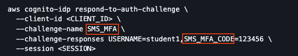
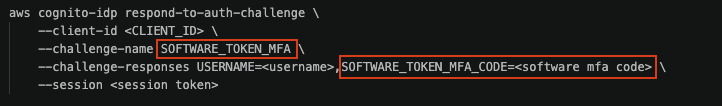

# 1.Project Issues/ Pain Points

## For the MFA Code section
| Link to cognito walkthrough: [Cognito Walkthrough](https://github.com/Jae1-alt/lambda/blob/main/lessond_cognito/cognito_walkthru.md)

In task 4, the second part asks you to take the session token (obtained from the first part of task 4) and pass it into the `aws cognito-idp respond-to-auth-challenge` commands.

It's important to note that the type of accetpable `--challenge-responses` will depend on the `--challenge-name` used. For this particular setup, I didn't use the regular SMS-MFA (MFA code given via SMS message), but instead used the MFA Code generate via and Authenticator app (basically a software token). 
- Image of Cognito respond auth challenge command for 'SMS_MFA' challenge, note the specified challenge name and the 'SMS_MFA_CODE' flags in the command:

|

- Edited Cognito respond auth challenge command, this time using the 'SOFTWARE_TOKEN_MFA' challenge, note the specified challenge name and the 'SOFTWARE_TOKEN_MFA_CODE' flags in the command, this works with the software token provided by an authenticator app:

|

Details on the different challenge command flags and their associated options canbe found here: 
[AWS Command Refernce for Cognito idp `respond_to_auth_challenge`](https://docs.aws.amazon.com/cli/latest/reference/cognito-idp/respond-to-auth-challenge.html#global-options)