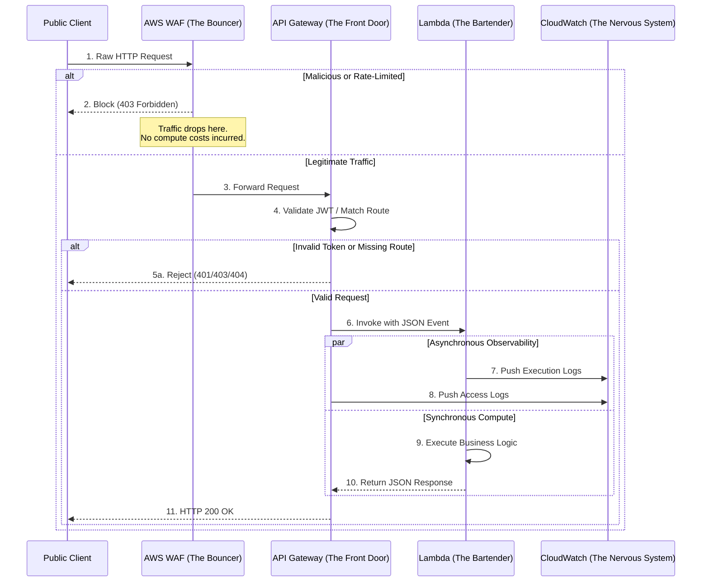

# Project Documentation: AWS Serverless Architecture, Security, and Observability Design

## 1. System Overview: The Serverless Request Lifecycle

This section outlines the complete data flow of the application. The architecture implements a mature, "Edge-First" security model where traffic is inspected, authenticated, and routed before it ever consumes billable compute resources.

---

## 2. The Compute Layer: AWS Lambda

### Architectural Rationale: Event-Driven Serverless & Firecracker
* **The Paradigm Shift:** The system transitions from traditional server management (EC2) to an event-driven paradigm. AWS Lambda operates as a **Runtime Execution Environment** rather than a language-specific tool. Underlying isolation is provided by **Firecracker microVMs**, which are ultra-lightweight, hardware-virtualized machines provisioned in milliseconds.
* **Operational Value:** This architecture provides hard multi-tenant isolation. The engineering team is absolved of OS patching and daemon management, and the organization only pays for the exact milliseconds of compute time consumed.

### Component Anatomy: Deployment States & Code Packaging
* **State Management (`$LATEST` vs. Versions):** 
  * **`$LATEST`**: The drafting environment. Code updates are applied here first without affecting live traffic.
  * **`Versions` & `Aliases`**: Production deployments utilize immutable snapshots (Versions). Traffic is routed via Aliases (e.g., `PROD`), providing a safe mechanism for rollbacks and blue/green deployments.
* **Packaging Strategy (Direct ZIP Upload):** 
  * For this specific project scope, the architecture utilizes the **Direct ZIP Upload** pattern. By leveraging Terraform's `data "archive_file"` resource, the code is zipped locally during the plan/apply phase and uploaded directly to the Lambda service via the API. 
  * **Rationale:** Because the application payloads are extremely lightweight and well under the 50MB API limit, direct upload provides the most straightforward, frictionless deployment mechanism for rapid iteration. 
  * **Production Evolution:** It is documented that as dependencies grow or as the project transitions to mature CI/CD pipelines, the architecture will evolve to the **S3-hosted ZIP pattern** (`s3_bucket` and `s3_key`). This future state decouples artifact storage from infrastructure deployment and bypasses the 50MB direct upload limit.

### Under-the-Hood Mechanics: The Runtime API & The JSON Contract
* **The Translation Layer:** Lambda does not process HTTP natively; it processes JSON. Whether invoked by the Console Test button, a Function URL, or API Gateway, the trigger translates the HTTP request into a standardized **JSON Event Schema** (e.g., mapping query strings to `event['queryStringParameters']`).
* **The Observability Agent:** Inside the microVM, the **Lambda Runtime API** intercepts standard output, batches it, and utilizes the IAM Execution Role to asynchronously push logs to CloudWatch. This occurs in a side-channel, ensuring logging latency does not impact the HTTP response time.

### DevSecOps Guardrails: IAM Roles & Execution Risks
* **The Silent Failure:** If the IAM Execution Role (e.g., `AWSLambdaBasicExecutionRole`) is misconfigured or missing, the function may execute successfully, but the Runtime API will fail to push logs. *Operational Standard: If execution logs are absent in CloudWatch, the function is considered operationally blind and broken.*
* **Least Privilege Enforcement:** Execution roles must never utilize broad permissions like `AdministratorAccess`. IAM policies are strictly scoped to allow logging only to the specific Log Group ARN: `arn:aws:logs:<region>:<account>:log-group:/aws/lambda/<function-name>:*`.

---

## 3. The Routing Layer: API Gateway

### Architectural Rationale: The Front Door & IaC Plumbing
* **The Abstraction Gap:** The AWS Console abstracts complexity behind automated wizards. Terraform, however, maps 1:1 to the raw AWS API, requiring explicit definition of the underlying "plumbing." 
* **The Hierarchy:** 
  * **REST API**: The top-level container.
  * **Resource**: The specific URL path (e.g., `/python`).
  * **Method**: The permitted HTTP verb (e.g., `GET`).
  * **Integration**: The backend target (the Lambda function).
  * **Lambda Permission**: The resource-based policy allowing the integration to invoke the function.

### The 1:1 Routing Correlation: Mapping Resources to Lambdas
* **Architectural Design:** API Gateway operates as a stateless HTTP router. It does not inherently understand backend compute; it only understands routing rules. Therefore, if the architecture includes multiple distinct Lambda functions (e.g., Python and Node.js), it requires **completely separate, parallel routing chains** in API Gateway for each function.
* **Engineering Benefits:** 
  * **Independent Scaling:** Different functions can be allocated distinct memory and timeout configurations.
  * **Blast Radius Containment:** A failure in one route does not impact the availability of another.
  * **Granular IAM:** Each function maintains its own Execution Role and Resource-Based Policy, enforcing strict Least Privilege.

#### Required Resource Duplication per Lambda Function
To maintain this 1:1 correlation, the following four Terraform resources must be instantiated for *every* Lambda function exposed via the API:

1. **`aws_api_gateway_resource` (The Path)**
   * **Purpose:** Defines the unique URL namespace (e.g., `/python`) for the specific function.
   * **Why it duplicates:** Each function requires its own distinct endpoint path to allow clients to route traffic to the correct backend logic.
2. **`aws_api_gateway_method` (The Verb)**
   * **Purpose:** Dictates the allowed HTTP actions (e.g., `GET`) specifically for that resource path.
   * **Why it duplicates:** Different functions may require different HTTP verbs (e.g., one function only accepts `GET`, while another accepts `POST`). The method must be explicitly bound to the specific resource.
3. **`aws_api_gateway_integration` (The Bridge)**
   * **Purpose:** Maps the specific method to the specific Lambda ARN, handling the HTTP-to-JSON translation protocol (including the internal `POST` quirk required by the Lambda Runtime API).
   * **Why it duplicates:** The integration is the actual wiring that tells API Gateway *which* Lambda to invoke when the specific path and verb are matched.
4. **`aws_lambda_permission` (The Security Badge)**
   * **Purpose:** Updates the Lambda's resource-based policy to explicitly allow the API Gateway service principal (`apigateway.amazonaws.com`) to invoke *this specific* function.
   * **Why it duplicates:** Without a dedicated permission resource for each function, API Gateway will receive an "Access Denied" error at the IAM layer, resulting in a 502 Bad Gateway.

*(Note: While these resources must be duplicated architecturally, Terraform's `for_each` meta-argument is utilized in the codebase to iterate over a map of functions, preventing manual code duplication while maintaining this strict 1:1 boundary.)*

### Component Anatomy: REST API vs HTTP API
* **REST API (v1)**: Verbose and feature-rich. Supports native AWS WAF, caching, and request validation. Incurs higher latency and cost.
* **HTTP API (v2)**: Streamlined, 70% cheaper, and lower latency. Lacks native WAF and caching. Combines Resources and Methods into a single "Route" concept and auto-deploys to a `$default` stage.
* **Selection Criteria:** REST API is selected when native WAF or complex usage plans are required. HTTP API is selected for high-traffic, simple Lambda integrations where cost and latency optimization are paramount.

### Under-the-Hood Mechanics: Deployments and State
* **The Deployment Snapshot:** API Gateway separates configuration from live state. Infrastructure as Code must explicitly create an `aws_api_gateway_deployment` and attach it to an `aws_api_gateway_stage`. A `triggers` block hashing the underlying resource IDs ensures Terraform automatically creates a new snapshot whenever the routing configuration changes.

### DevSecOps Guardrails: 502 Errors & Missing Permissions
* **The 502 Bad Gateway:** If the API returns a 502 error and CloudWatch shows no execution logs, the `aws_lambda_permission` resource is almost certainly missing. API Gateway attempted to invoke the Lambda, but the function's resource-based policy blocked it at the IAM layer.
* **The `ANY` Method Trap:** Production environments must never utilize `http_method = "ANY"`. This violates Least Privilege by permitting `POST`, `PUT`, and `DELETE` on endpoints designed strictly for `GET` operations.

---

## 4. The Edge Security Layer: WAF & JWT

### Architectural Rationale: Edge-First Security & Zero Trust
* **The Perimeter Paradigm:** The system enforces a "fail-fast" security posture. If a malicious payload reaches the Lambda function, the organization has already incurred compute costs. AWS WAF blocks malicious traffic at the network edge, while JWT Authorizers block unauthenticated traffic at the application edge.
* **Operational Value:** By validating identity and sanitizing inputs at API Gateway, the Lambda functions are restricted to processing only verified, legitimate business logic.

### Component Anatomy: Web ACLs, Managed Rules, and JWT Trust Anchors
* **The Web ACL:** In AWS WAF, there is no separate "Firewall" resource. The `aws_wafv2_web_acl` acts as the firewall itself, consuming modular building blocks like `aws_wafv2_ip_set` (for blocklists) and AWS Managed Rule Groups (for SQLi/XSS protection).
* **JWT (JSON Web Token):** A standard format for representing claims. Identity Providers (IdPs) like Auth0 and Amazon Cognito mint and sign these tokens.
* **Trust Anchors:** API Gateway validates JWTs using the **Issuer** (the signing authority) and the **Audience** (the intended recipient). If the Audience claim in the token does not exactly match the API Gateway configuration, the request is immediately rejected.

### Under-the-Hood Mechanics: WAF Evaluation & JWKS Verification
* **WAF Priority:** WAF evaluates rules sequentially by priority. Rate-Based Rules are placed at Priority 1 to block high-volume bots instantly, preventing them from triggering more expensive Managed Rule Group evaluations.
* **JWKS (JSON Web Key Set):** API Gateway does not share a symmetric secret with the IdP. Instead, it downloads the IdP's public keys (the JWKS file) and utilizes asymmetric cryptography to mathematically verify the token's signature.

### DevSecOps Guardrails: False Positives, Token Leakage, & Scope
* **WAF False Positives:** WAF Managed Rules must never be deployed directly to `Block` mode in production. They are deployed in `Count` mode first to monitor for legitimate traffic triggers. Once exclusions are tuned, the action is switched to `Block`.
* **JWT Leakage:** API Gateway passes raw HTTP headers (including the `Authorization: Bearer <token>` header) into the Lambda `event` object. If the Lambda logs the raw event, the JWT is written to CloudWatch in plain text. Application-level log scrubbing is mandatory.
* **ID vs. Access Tokens:** When integrating with Cognito, the frontend must transmit the **Access Token** to API Gateway, not the ID Token. The Access Token contains the user's groups and scopes required for backend authorization.

---

## 5. The Observability Layer: CloudWatch

### Architectural Rationale: Centralized Nervous System & Forensics
* **The Serverless Black Box:** In a serverless environment, traditional host-level monitoring (SSH) is absent. CloudWatch serves as the sole window into the execution environment. 
* **Security Incident Response:** CloudWatch acts as the forensic crime scene. Engineering must correlate WAF blocks, API Gateway rejections, and Lambda execution errors to reconstruct the full timeline of an attack or system outage.

### Component Anatomy: Metrics vs. Logs
* **Metrics (The Dashboard):** Time-series numerical data (e.g., `Duration: 142ms`, `Count: 5`). They are cheap, aggregated, and utilized for real-time alerting. Metrics indicate *that* an event occurred.
* **Logs (The Crime Scene):** Raw, textual, granular records (e.g., stack traces, JSON payloads). They are expensive, stored as append-only text, and used for debugging and forensics. Logs explain *why* an event occurred.

### Under-the-Hood Mechanics: Log Groups, Retention, & Structured Logging
* **The Ingestion Path:** Lambda utilizes the Runtime API to batch logs. API Gateway and WAF push their logs directly to CloudWatch via explicit Terraform configurations.
* **Structured Logging:** API Gateway Access Logs are forced into a JSON format using `jsonencode()` and mapping variables (e.g., `$context.identity.sourceIp`). This enables **CloudWatch Logs Insights**, allowing engineers to run SQL-like queries to instantly isolate attackers or broken clients.

### DevSecOps Guardrails: PII, Forever Logs, & Alerting
* **The "Forever Logs" Trap:** If AWS is permitted to auto-create Log Groups, the default retention is set to "Never Expire." This causes massive cost spikes and compliance failures. Infrastructure as Code must explicitly define `aws_cloudwatch_log_group` with a strict `retention_in_days` parameter.
* **Encryption at Rest:** In regulated environments, Log Groups must be encrypted using a Customer-Managed KMS Key (`kms_key_id`), rather than relying solely on default AWS-managed keys.
* **Alerting Standards:** Engineering must never write scripts that scan logs for the word "Error" to trigger alerts. CloudWatch Alarms must be configured on the native `Errors` metric. Logs are utilized exclusively for investigating the root cause *after* a metric alarm fires.

---

## 6. Consolidated Sources & References

**[1] AWS Documentation: What is AWS Lambda? (Firecracker & Execution Environments)**  
https://docs.aws.amazon.com/lambda/latest/dg/gettingstarted-concepts.html

**[2] AWS Documentation: AWS Lambda Deployment Packages (ZIP vs Container)**  
https://docs.aws.amazon.com/lambda/latest/dg/gettingstarted-package.html

**[3] AWS Documentation: AWS Lambda Function Versions and Aliases**  
https://docs.aws.amazon.com/lambda/latest/dg/configuration-versions.html

**[4] Terraform Registry: `archive_file` Data Source (Local Zipping for Direct Upload)**  
https://registry.terraform.io/providers/hashicorp/archive/latest/docs/data-sources/file

**[5] AWS Documentation: Choosing between REST APIs and HTTP APIs**  
https://docs.aws.amazon.com/apigateway/latest/developerguide/http-api-vs-rest-api.html

**[6] Terraform Registry: `aws_api_gateway_integration` (The internal POST method quirk)**  
https://registry.terraform.io/providers/hashicorp/aws/latest/docs/resources/api_gateway_integration

**[7] Terraform Documentation: `for_each` Meta-Argument (Managing 1:1 Resource Correlations)**  
https://developer.hashicorp.com/terraform/language/meta-arguments/for_each

**[8] Terraform Registry: `aws_api_gateway_deployment` (Triggers and snapshots)**  
https://registry.terraform.io/providers/hashicorp/aws/latest/docs/resources/api_gateway_deployment

**[9] AWS Documentation: Permissions for invoking Lambda functions (Resource-Based Policies)**  
https://docs.aws.amazon.com/lambda/latest/dg/access-control-resource-based.html

**[10] AWS Documentation: What is AWS WAF? (Web ACLs and Rule Evaluation)**  
https://docs.aws.amazon.com/waf/latest/developerguide/what-is-aws-waf.html

**[11] Terraform Registry: `aws_wafv2_web_acl_association` (Attaching WAF to API Gateway)**  
https://registry.terraform.io/providers/hashicorp/aws/latest/docs/resources/wafv2_web_acl_association

**[12] AWS Documentation: Controlling access to HTTP APIs with JWT authorizers**  
https://docs.aws.amazon.com/apigateway/latest/developerguide/http-api-jwt-authorizer.html

**[13] Auth0 Documentation: Introduction to JSON Web Tokens (JWT Structure)**  
https://auth0.com/docs/secure/tokens/json-web-tokens/get-started-with-json-web-tokens

**[14] AWS Documentation: Using Tokens with Amazon Cognito (ID vs Access vs Refresh)**  
https://docs.aws.amazon.com/cognito/latest/developerguide/amazon-cognito-user-pools-using-tokens-with-identity-providers.html

**[15] AWS Documentation: Amazon CloudWatch Logs Concepts (Groups, Streams, Retention)**  
https://docs.aws.amazon.com/AmazonCloudWatch/latest/logs/CloudWatchLogsConcepts.html

**[16] AWS Documentation: Setting up CloudWatch API Gateway access logging**  
https://docs.aws.amazon.com/apigateway/latest/developerguide/set-up-logging.html

**[17] Terraform Registry: `aws_cloudwatch_log_group` (Retention and KMS encryption)**  
https://registry.terraform.io/providers/hashicorp/aws/latest/docs/resources/cloudwatch_log_group

**[18] AWS Documentation: Querying CloudWatch Logs using Logs Insights**  
https://docs.aws.amazon.com/AmazonCloudWatch/latest/logs/CWL_QuerySyntax.html

**[19] AWS Well-Architected Framework: Serverless Application Lens**  
https://docs.aws.amazon.com/wellarchitected/latest/serverless-application-lens/serverless-application-lens.html