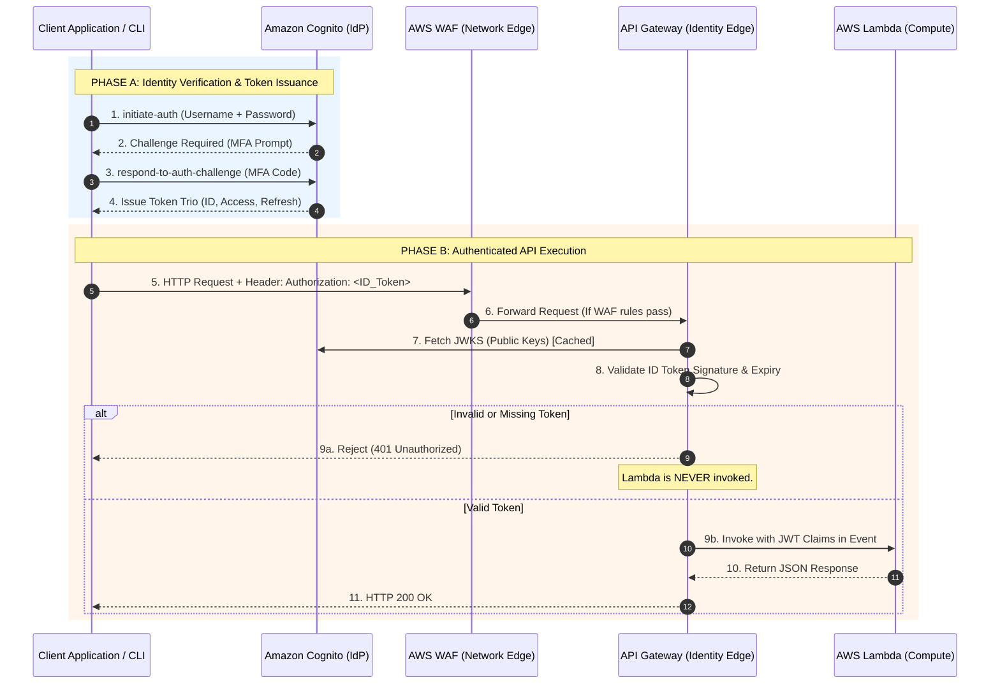
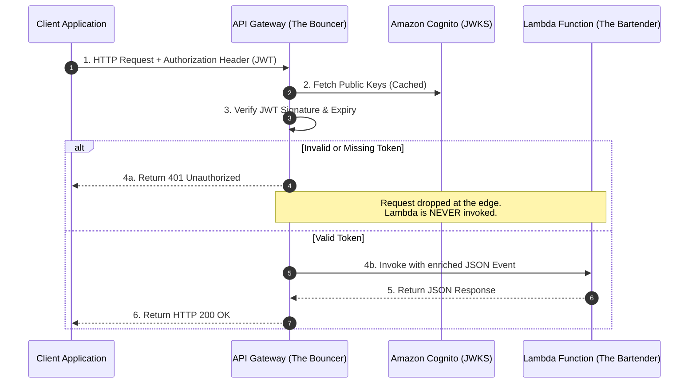

# Project Documentation: Amazon Cognito Integration and Edge Authentication Design

## Section 1: Architectural Rationale and System Overview

### The Paradigm Shift: From Network Security to Identity Security
In the initial phase of this project, I secured the API perimeter using AWS WAF. While WAF successfully protected the network edge by filtering malicious payloads, rate-limiting bot traffic, and blocking SQL injection attempts, it operated under a fundamental limitation: it did not know who was making the request. The API was effectively anonymous; any client that passed the WAF rules could invoke the backend compute.

To transition this architecture to a true Zero Trust model, I recognized the need to shift the security boundary from network-level filtering to cryptographic identity verification. By integrating Amazon Cognito, I introduced an identity layer that answers the critical question: "Who are you?" This ensures that every API invocation is tied to a specific, authenticated user, enabling comprehensive audit trails, user-specific rate limiting, and personalized application logic.

### System Overview: The Authenticated Request Lifecycle
To fully comprehend the system, the lifecycle must be understood as two distinct, sequential phases: Identity Verification and Authenticated API Execution. The following diagram illustrates the complete data flow, from the initial credential submission to the final compute response, including the network-edge inspection by AWS WAF.



#### Detailed Diagram Walkthrough

**Phase A: Identity Verification & Token Issuance (Steps 1-4)**
Before the client can interact with the API, it must prove its identity to Amazon Cognito.
*   **Step 1:** The client initiates the authentication process by sending the user's credentials (username and password) to Cognito.
*   **Step 2:** Because Multi-Factor Authentication (MFA) is strictly enforced, Cognito does not immediately grant access. It pauses the session and issues a "Challenge" back to the client, prompting for an MFA code.
*   **Step 3:** The user provides the MFA code, and the client submits it to Cognito along with the session token from Step 2.
*   **Step 4:** Cognito validates the MFA code. Upon success, it acts as the Identity Provider (IdP) and mints the "Token Trio" (ID Token, Access Token, and Refresh Token), returning them to the client.

**Phase B: Authenticated API Execution (Steps 5-11)**
With a valid ID Token in hand, the client attempts to access the protected backend.
*   **Steps 5 & 6:** The client sends an HTTP request to the API, embedding the ID Token in the `Authorization` header. The request first passes through AWS WAF. If it passes the WAF rules, WAF forwards it to API Gateway.
*   **Steps 7 & 8:** API Gateway intercepts the request. It extracts the ID Token and acts as the Policy Decision Point. It fetches Cognito's public keys (JWKS) to mathematically verify the token's cryptographic signature and checks its expiration. 
*   **Step 9 (The Fork in the Road):** 
    *   *Path 9a (Failure):* If the token is missing, expired, or the signature is invalid, API Gateway immediately returns a `401 Unauthorized` to the client. Crucially, the request stops here. Lambda is never invoked, and no compute costs are incurred.
    *   *Path 9b (Success):* If the token is valid, API Gateway extracts the user's identity claims from the ID Token and injects them into the JSON event payload.
*   **Steps 10 & 11:** API Gateway invokes the Lambda function with the enriched JSON payload. Lambda executes the business logic, returns a JSON response to API Gateway, which then formats it as an HTTP 200 OK response and returns it to the client.

### The "Bouncer" Paradigm and Fail-Fast Compute Protection
To conceptualize the specific integration of Cognito with API Gateway during Phase B, I utilize the "Bouncer and Bartender" paradigm. In this architecture, API Gateway acts as the bouncer at the door, while the Lambda function acts as the bartender inside the VIP room. 

When a request arrives, the API Gateway Cognito Authorizer intercepts it before it reaches the compute layer. The Authorizer extracts the JSON Web Token (JWT) from the HTTP header, fetches the public keys from Cognito (JWKS), and mathematically verifies the token's signature and expiration. 

This design enforces a strict "fail-fast" security posture. By offloading the heavy cryptographic lifting to the managed API Gateway service, my Lambda code is freed to focus exclusively on business logic, completely decoupling identity verification from application execution.

The following sequence diagram illustrates this specific edge-interception lifecycle:



### Public vs. Confidential Clients: The Client Secret Decision
When configuring the Cognito App Client (the entity that represents my application to the User Pool), I made a deliberate architectural decision to disable the client secret, configuring it as a "Public Client."

In AWS Cognito, a "Confidential Client" utilizes a client secret to prove its identity to the User Pool. This is appropriate for secure backend servers that can safely store secrets in environment variables. However, my application's clients are a CLI tool and potentially a frontend Single Page Application (SPA). These are distributed environments where the code is executed on the end-user's local machine or in their browser. 

If I were to enable a client secret, it would have to be hardcoded into the CLI script or exposed in the frontend JavaScript. Any user could inspect the source code or network traffic, extract the secret, and impersonate the application. By disabling the client secret, I eliminated this vulnerability. The security of the authentication flow now relies entirely on the user's credentials (username/password) and their physical possession of an MFA device, rather than a compromised application secret.

### The Token Trio: Separation of Concerns
Upon successful authentication, Cognito does not just issue a single token; it mints a "Token Trio." Understanding the distinct purpose of each token was critical for my API design. 

To illustrate the structural differences, here is a generic representation of the claims contained within the ID Token versus the Access Token:

**The ID Token (Focus: User Identity)**
```json
{
  "sub": "a1b2c3d4-e5f6-7890-g1h2-i3j4k5l6m7n8",
  "email": "user@example.com",
  "email_verified": true,
  "aud": "app-client-id-12345",
  "token_use": "id"
}
```
This token is intended strictly for the frontend application or the client UI to display user context. Notice the presence of the `aud` (audience) claim, which identifies the intended recipient of the token.

**The Access Token (Focus: Permissions and Scopes)**
```json
{
  "sub": "a1b2c3d4-e5f6-7890-g1h2-i3j4k5l6m7n8",
  "scope": "api.read api.write",
  "client_id": "app-client-id-12345",
  "token_use": "access"
}
```
This token is intended strictly for the backend API to authorize actions. Notice that it contains the `scope` claim for fine-grained permissions, but it intentionally omits the `aud` claim. This structural difference is the root cause of specific API Gateway validation behaviors, which I address in Section 4 of this documentation.

**The Refresh Token**
This is a long-lived, opaque string used to request new ID and Access tokens silently in the background. It ensures the user does not have to re-enter their password and MFA code every time the short-lived Access Token expires.

### The Hosted UI and the User Authentication Experience
While the backend infrastructure handles the cryptographic validation, the end-user requires a secure interface to input their credentials and configure their MFA device. Amazon Cognito provides this via the Hosted UI, a managed web interface served from a custom Cognito domain prefix.

For this project, I made the deliberate architectural decision to utilize the default AWS styling for the Hosted UI, intentionally omitting the `aws_cognito_user_pool_ui_customization` resource. While custom CSS and logo uploads are supported, relying on the default interface significantly reduces maintenance overhead. It provides a fully functional, secure login experience and, crucially, handles the complex MFA setup state machine automatically. 

When a user authenticates via the Hosted UI for the first time, Cognito automatically detects the missing TOTP device and presents a QR code for the user to scan with their authenticator app. This seamlessly bridges the gap between the provisioned identity in Terraform and the physical possession factor required for MFA, without requiring me to build a bespoke frontend authentication flow or manually execute CLI MFA association commands.

***

**Consolidated Sources for Section 1:**
*   [AWS Documentation: Amazon Cognito User Pools](https://docs.aws.amazon.com/cognito/latest/developerguide/cognito-user-identity-pools.html)
*   [AWS Documentation: Using Tokens with Amazon Cognito](https://docs.aws.amazon.com/cognito/latest/developerguide/amazon-cognito-user-pools-using-tokens-with-identity-providers.html)
*   [AWS Documentation: Working with App Clients](https://docs.aws.amazon.com/cognito/latest/developerguide/user-pool-settings-attributes.html)
*   [AWS Documentation: Adding the Hosted UI for Your User Pool](https://docs.aws.amazon.com/cognito/latest/developerguide/cognito-user-pools-app-integration.html)
*   [AWS Documentation: Customizing the Hosted UI](https://docs.aws.amazon.com/cognito/latest/developerguide/cognito-user-pools-custom-ui.html)
*   [AWS Documentation: Controlling Access to a REST API with an Amazon Cognito User Pool Authorizer](https://docs.aws.amazon.com/apigateway/latest/developerguide/apigateway-integrate-with-cognito.html)
*   [Terraform Registry: aws_cognito_user_pool_domain](https://registry.terraform.io/providers/hashicorp/aws/latest/docs/resources/cognito_user_pool_domain)
*   [NIST Special Publication 800-63B: Digital Identity Guidelines](https://pages.nist.gov/800-63-3/sp800-63b.html)

