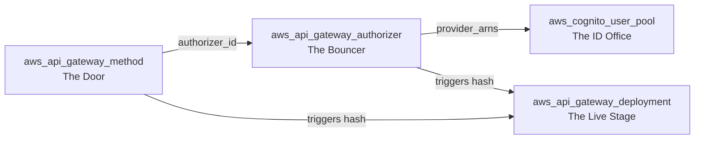

## Section 2: Infrastructure Implementation and Terraform Mechanics

### The User Pool: Identity Directory Configuration

**The AWS Concept**
The foundation of the identity architecture is the Amazon Cognito User Pool, which serves as the managed identity directory. It is responsible for handling user sign-up, sign-in, password policies, and account recovery. For this project, I configured the directory to support multiple sign-in inputs without sacrificing a primary username identifier. By utilizing "aliases," the directory allows users to authenticate using their email address as a proxy, while preserving a standard text-based username as the underlying identity. 

Furthermore, to enforce a strict security posture, I mandated Multi-Factor Authentication (MFA) at the directory level and disabled public self-service sign-up. This ensures that the identity directory remains a closed system, accessible only to identities provisioned by authorized administrators or automated pipelines.

**The Terraform Implementation**
In Terraform, this directory is represented by the `aws_cognito_user_pool` resource. The conceptual requirements map to the following critical settings:
*   **Multi-Input Sign-In:** I utilized the `alias_attributes` argument, setting it to `["email"]`. This enables the email proxy behavior while keeping the standard username intact. 
*   **Password Policy:** I configured the `password_policy` block to enforce a minimum of 8 characters, strictly requiring both numbers and symbols to ensure baseline credential strength.
*   **MFA Enforcement:** I set the pool-level `mfa_configuration` to `"ON"` and enabled the `software_token_mfa_configuration` block. This forces every authentication attempt to satisfy a TOTP (Time-based One-Time Password) second-factor challenge before tokens are issued.
*   **Disabling Self-Service Sign-Up:** To maintain strict control over the directory, I configured the `admin_create_user_config` block with `allow_admin_create_user_only` set to `true`. This blocks public sign-up attempts via the Cognito API.

### The App Client: Application Bridge and OAuth Configuration

**The AWS Concept**
While the User Pool holds the identities, the App Client acts as the "valet key" that allows my specific application to interact with the directory. It dictates how the application authenticates and what tokens it receives. 

A critical architectural decision for this project was configuring the App Client as a "Public Client." Because the application is a CLI tool running on a user's local machine, it cannot securely store a hardcoded client secret. By disabling the client secret, the security of the authentication flow relies entirely on the user's credentials and their physical possession of an MFA device. 

Additionally, to enable the visual Hosted UI for the login and MFA setup experience, the App Client must be configured to support the OAuth 2.0 Authorization Code flow. This requires explicitly defining the allowed OAuth flows, the scopes (what user data the application is permitted to see), the callback URLs (where Cognito redirects the user after authentication), and the supported identity providers.

**The Terraform Implementation**
This bridge is represented by the `aws_cognito_user_pool_client` resource. The conceptual requirements map to the following critical settings:
*   **Public Client Paradigm:** I explicitly set `generate_secret` to `false`. This prevents Terraform from generating a client secret, enforcing the Public Client paradigm.
*   **Explicit Authentication Flows:** I utilized the `explicit_auth_flows` argument to specifically enable `ALLOW_USER_PASSWORD_AUTH` (required for the CLI authentication flow) and `ALLOW_REFRESH_TOKEN_AUTH` (to ensure the long-lived Refresh Token functions correctly).
*   **Token Lifetimes:** I utilized the `token_validity_units` block paired with the respective integer validity arguments. I configured the Access and ID tokens to expire in 60 minutes, while setting the Refresh Token to 30 days.
*   **Hosted UI OAuth Configuration:** To enable the visual login page, I set `allowed_oauth_flows` to `["code"]`, defined the `allowed_oauth_scopes` as `["openid", "email", "profile"]`, and enabled the `allowed_oauth_flows_user_pool_client` toggle. I set the `callback_urls` to `["http://localhost"]` to handle the post-login redirect during testing, and restricted the `supported_identity_providers` to `["COGNITO"]`.

### The Cognito Domain: Enabling the Hosted UI

**The AWS Concept**
The Hosted UI requires a public-facing web address to serve the login pages. Amazon Cognito provides this via a managed domain prefix. This prefix becomes the base URL for the login interface. 

For this project, I made the deliberate architectural decision to utilize the default AWS styling for the Hosted UI. While Cognito allows for custom CSS and logo uploads via the UI Customization resource, relying on the default interface significantly reduces maintenance overhead. It provides a fully functional, secure login experience and automatically handles the complex MFA setup state machine, presenting a QR code to the user upon their first login without requiring bespoke frontend code.

**The Terraform Implementation**
The domain is represented by the `aws_cognito_user_pool_domain` resource. The critical setting is the `domain` argument, which requires a globally unique prefix. AWS automatically appends the region and the `amazoncognito.com` suffix to this prefix to generate the final URL. 

Because I opted for the default styling, I intentionally omitted the `aws_cognito_user_pool_ui_customization` resource from my Terraform configuration. The absence of this resource instructs AWS to serve the unmodified, default interface.

### User Provisioning: Bypassing Verification for Project Velocity

**The AWS Concept**
When creating a user in Cognito, the default behavior is to generate a temporary password and trigger an email verification workflow. The user is then forced to change their password upon first login. For this project, I needed to pre-provision a test user with a permanent password and a pre-verified email address, entirely bypassing the verification workflow to allow for immediate CLI testing. This requires explicitly suppressing the outbound welcome messages and overriding the verification status at the exact moment of user creation.

**The Terraform Implementation**
This is represented by the `aws_cognito_user` resource. The conceptual requirements map to the following critical settings:
1.  **`password`**: By providing a permanent password directly that meets the pool's password policy, the user is created in a `CONFIRMED` state, bypassing the temporary password workflow.
2.  **`message_action`**: I set this to `"SUPPRESS"`. This prevents Cognito from attempting to send a welcome email to the placeholder email address, which would fail and potentially cause the user creation to enter a locked state.
3.  **`attributes`**: Within the attributes map, I explicitly set `email_verified` to the string value `"true"`. This instructs Cognito to mark the email as pre-verified at creation, entirely bypassing the verification code workflow.

### API Gateway Wiring: The Chain of Trust

**The AWS Concept**
The most architecturally significant aspect of this integration is wiring the Cognito Authorizer into the existing API Gateway routing layer. API Gateway acts as the enforcement point, but it requires explicit instructions on which identity provider to trust and which routes to protect. 

This requires establishing a "Chain of Trust." First, an Authorizer must be created and explicitly linked to the Cognito User Pool's ARN. Second, the specific API Gateway Method (the route) must be updated to delegate its authorization logic to that specific Authorizer. Finally, because REST APIs separate the configuration plane from the data plane, modifying the Method's authorization settings only updates the configuration state. To push this security boundary to the live environment, a new deployment must be explicitly triggered.

The following diagram illustrates how these resources link together to form the complete authorization chain:

**The Terraform Implementation**
This chain is realized through three distinct resources:
*   **Creating the Authorizer:** In the `aws_api_gateway_authorizer` resource, the critical setting is `provider_arns`. This argument accepts a list of Cognito User Pool ARNs. I wrapped the User Pool's ARN in square brackets to satisfy the list data type, linking the Bouncer to the ID Office.
*   **Attaching to the Method:** In the `aws_api_gateway_method` resource, I changed the `authorization` argument from `"NONE"` to `"COGNITO_USER_POOLS"` and populated the `authorizer_id` argument with the ID of the newly created Authorizer. This explicitly tells the routing door to hand every request to the Bouncer.
*   **Forcing the Redeployment:** To push the updated configuration to the live `prod` stage, I included the Authorizer ID in the `triggers` block of the `aws_api_gateway_deployment` resource. This ensures that any change to the Authorizer automatically generates a new SHA1 hash, forcing Terraform to recreate the deployment and activate the security boundary.

### Client-Level vs. Infrastructure-Level Authorization

A critical architectural distinction emerged during this implementation that must be clearly documented.

Unlike IAM and Lambda authorizers, the `COGNITO_USER_POOLS` authorizer type uses the user-associated JWT, automatically issued by Cognito, to perform the authorization needed for a given user to allow access through API Gateway to the application. Unlike the other authorizer types, I do not need to create IAM users, access keys, a dedicated Lambda function, or policies to evaluate tokens and grant CLIENT access to the application.

However, while Cognito eliminates the need for IAM policies to manage user-level access, the infrastructure itself still requires standard AWS IAM resource-based policies to function. The `aws_lambda_permission` resource, which grants the API Gateway service principal permission to invoke the Lambda function, remains absolutely mandatory. Without it, even a perfectly authenticated request will fail with a `502 Bad Gateway` error because API Gateway will be denied at the IAM layer when attempting to invoke the backend.

The distinction is precise: Cognito handles the authorization of the **client** (the human user). IAM handles the authorization of the **infrastructure** (API Gateway invoking Lambda). Both must be correctly configured for the project to function.

***

**Sources for Section 2:**
*   [Terraform Registry: aws_cognito_user_pool](https://registry.terraform.io/providers/hashicorp/aws/latest/docs/resources/cognito_user_pool)
*   [Terraform Registry: aws_cognito_user_pool_client](https://registry.terraform.io/providers/hashicorp/aws/latest/docs/resources/cognito_user_pool_client)
*   [Terraform Registry: aws_cognito_user_pool_domain](https://registry.terraform.io/providers/hashicorp/aws/latest/docs/resources/cognito_user_pool_domain)
*   [Terraform Registry: aws_cognito_user](https://registry.terraform.io/providers/hashicorp/aws/latest/docs/resources/cognito_user)
*   [Terraform Registry: aws_api_gateway_authorizer](https://registry.terraform.io/providers/hashicorp/aws/latest/docs/resources/api_gateway_authorizer)
*   [Terraform Registry: aws_api_gateway_method](https://registry.terraform.io/providers/hashicorp/aws/latest/docs/resources/api_gateway_method)
*   [Terraform Registry: aws_api_gateway_deployment](https://registry.terraform.io/providers/hashicorp/aws/latest/docs/resources/api_gateway_deployment)
*   [AWS Documentation: Controlling Access to a REST API with an Amazon Cognito User Pool Authorizer](https://docs.aws.amazon.com/apigateway/latest/developerguide/apigateway-integrate-with-cognito.html)
*   [AWS Documentation: Using the Hosted UI for Authentication](https://docs.aws.amazon.com/cognito/latest/developerguide/cognito-user-pools-app-integration.html)

