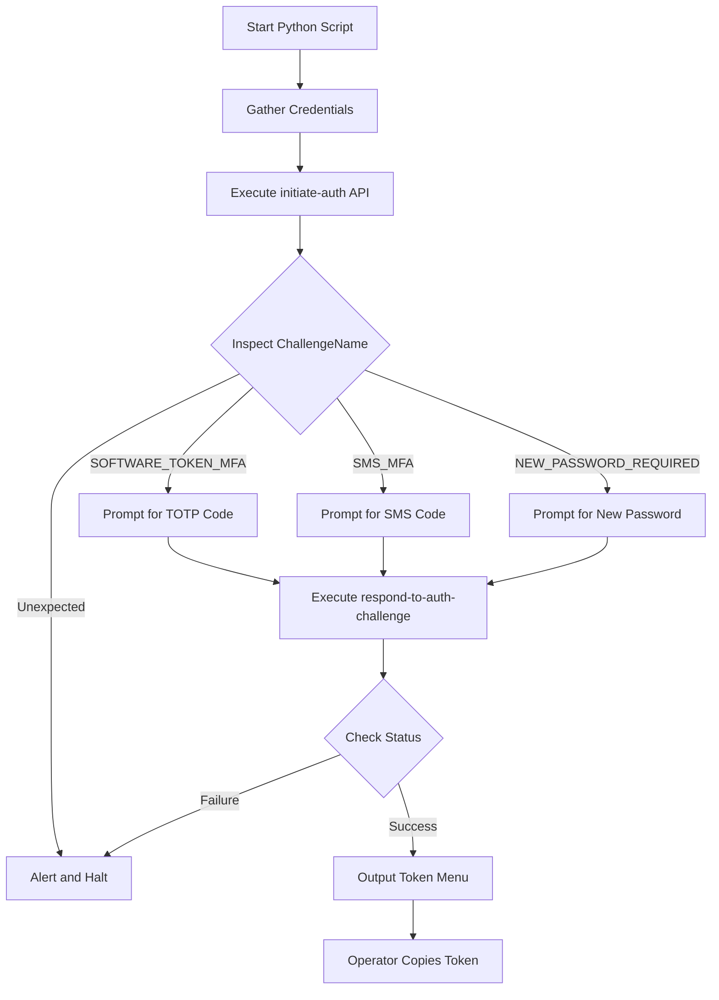
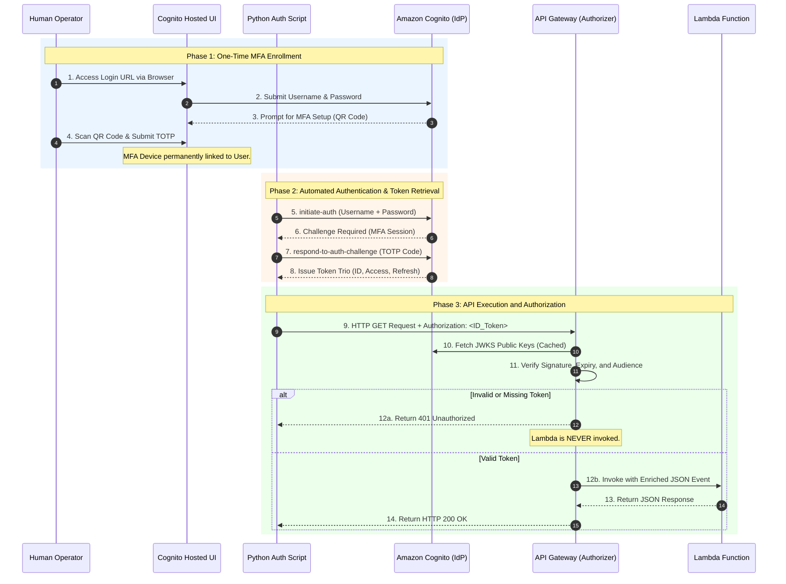

## Section 3: Operational Execution and the Authentication Lifecycle

### Phase 1: The Hosted UI and MFA Enrollment

**The AWS Concept**
While Terraform successfully provisions the identity record and enforces the MFA requirement at the directory level, it cannot provision the physical possession factor. Multi-Factor Authentication requires a physical device (like a smartphone running an authenticator app) to be cryptographically linked to the user account. Because I opted to use the default AWS styling for the Cognito Hosted UI, this interface automatically handles the complex state machine of the initial MFA setup.

**The Operational Execution**
To bridge the gap between the provisioned identity and the physical MFA device, I utilized the Hosted UI for a one-time enrollment process.
1. I accessed the dynamically generated Hosted UI URL (constructed via Terraform outputs) in a web browser.
2. I entered the pre-provisioned username and password.
3. Because MFA was enforced but no device was yet linked, Cognito automatically intercepted the login flow and presented a TOTP QR code.
4. I scanned the QR code using my mobile authenticator app and submitted the generated 6-digit code back into the browser.

Upon successful verification, the Hosted UI redirected to the configured callback URL. At this exact moment, the user's MFA device was permanently associated with the Cognito identity, allowing all subsequent programmatic authentication to succeed.

### Phase 2: The Challenge-Response Flow and Token Retrieval

**The AWS Concept**
With the MFA device enrolled, the operational testing transitions to programmatic authentication. Because MFA is strictly enforced, Cognito does not immediately issue tokens when a user provides a valid username and password. Instead, it utilizes a stateful challenge-response protocol. The initial authentication request pauses, returning a session identifier and a challenge request. The client must then resolve this challenge by providing the required factor before Cognito will mint and return the Token Trio.

**The Manual CLI Execution**
To understand the underlying API mechanics, I first executed the flow manually using the AWS CLI. 

I initiated the authentication using the `initiate-auth` command, providing the App Client ID, the `USER_PASSWORD_AUTH` flow, and the user credentials. Because MFA is required, the API response returned a `Session` string and a `ChallengeName` of `SOFTWARE_TOKEN_MFA`. 

I then executed the `respond-to-auth-challenge` command, passing the session string and the 6-digit TOTP code. Upon validating the code against the session state, Cognito successfully authenticated the user and returned the `AuthenticationResult` containing the Access Token, the ID Token, and the Refresh Token.

**The Manual Operational Execution**
To interact with this protocol, I executed a two-step authentication flow using the AWS CLI, utilizing the App Client ID exposed via Terraform outputs.

**Step 1: Initiating the Authentication**
I executed the `initiate-auth` command, providing the App Client ID, the authentication flow type, and the user credentials.

```bash
aws cognito-idp initiate-auth \
  --auth-flow USER_PASSWORD_AUTH \
  --client-id <COGNITO_APP_CLIENT_ID> \
  --auth-parameters USERNAME=lizzo1,PASSWORD=SuperSecretPassword123!
```

Because MFA is required, the API response did not contain tokens. Instead, it returned a `Session` string and a `ChallengeName` of `SOFTWARE_TOKEN_MFA`. This session string acts as a temporary cryptographic state, proving to Cognito that this specific user has successfully passed the first factor (password) and is now authorized to attempt the second factor.

**Step 2: Resolving the MFA Challenge**
Using the session string from the previous step and the current 6-digit code generated by my authenticator app, I executed the `respond-to-auth-challenge` command.

```bash
aws cognito-idp respond-to-auth-challenge \
  --client-id <COGNITO_APP_CLIENT_ID> \
  --challenge-name SOFTWARE_TOKEN_MFA \
  --challenge-responses USERNAME=lizzo1,SOFTWARE_TOKEN_MFA_CODE=123456 \
  --session <SESSION_STRING_FROM_STEP_1>
```

Upon validating the MFA code against the session state, Cognito successfully authenticated the user and returned the `AuthenticationResult`. This JSON payload contains the Access Token, the ID Token, and the Refresh Token. For the purpose of calling the API Gateway, I extracted and stored the ID Token.

---

**The Automated Python Wrapper**

While the manual CLI commands successfully demonstrate the API mechanics, copying and pasting session strings and manually parsing the final JSON payload is inefficient for repeated testing. To streamline this process, I engineered a Python script to automate the entire challenge-response state machine. This pyhton script is the [easier_get_token_v2.py](../../../0.python_codes/easier_get_token_v2.py) file, in the `/0.python_codes` folder.

The script abstracts the manual steps into a single, cohesive workflow. It accepts four secure inputs from the operator: the `client_id`, the AWS `region`, the `username`, and the `password` (captured securely via the `getpass` module to prevent terminal echoing).

Once the credentials are provided, the script programmatically executes the `initiate-auth` API call. It then inspects the `ChallengeName` in the API response and dynamically routes the execution to the appropriate handler. The script is designed to evaluate and resolve the three primary Cognito challenges:
*   `SOFTWARE_TOKEN_MFA`: Prompts the operator for the 6-digit TOTP code.
*   `SMS_MFA`: Prompts the operator for the SMS verification code.
*   `NEW_PASSWORD_REQUIRED`: Prompts the operator to define a new permanent password.

If the API returns an unsupported or unexpected challenge, the script immediately alerts the operator and halts execution to prevent unhandled exceptions. Upon a successful challenge resolution, the script parses the final `AuthenticationResult` and presents the operator with a clean, formatted menu to extract and copy the specific ID Token, Access Token, or Refresh Token as needed.

The following flowchart illustrates the dynamic routing logic implemented in the Python script:



By building this wrapper, I transitioned the authentication process from a manual, multi-step CLI exercise into a repeatable, user-friendly operational tool.

### Phase 3: The API Gateway Interception and JWT Validation

**The AWS Concept**
Once the client possesses the ID Token, it transitions from the identity verification phase to the API execution phase. The client makes an HTTP request to the API Gateway endpoint, embedding the ID Token in the `Authorization` header. 

At this point, the API Gateway Cognito Authorizer intercepts the request. It extracts the token, fetches the JSON Web Key Set (JWKS) from the Cognito User Pool (caching these keys to minimize latency), and mathematically verifies the token's signature, expiration, and audience (`aud`) claim. If the token is valid, the Authorizer approves the request and extracts the user's identity claims to pass down to the compute layer.

The following sequence diagram illustrates the complete operational lifecycle, from the initial Hosted UI MFA setup to the final Lambda execution:



### Phase 4: The Enriched Event Payload

**The AWS Concept**
One of the most powerful features of the API Gateway Cognito Authorizer is that it completely removes the need for the backend compute to parse or validate JWTs. When the Authorizer approves a request, it does not just pass the raw HTTP headers to the Lambda function. Instead, it parses the ID Token, extracts the user's identity claims, and injects them directly into the JSON `event` object under a specific, standardized path.

**The Operational Reality**
When my Lambda function is invoked, the `event` payload contains a nested dictionary at `requestContext.authorizer.claims`. This dictionary holds the exact user attributes defined in the Cognito User Pool.

Here is a generic representation of the enriched `event` payload that the Lambda function receives:

```json
{
  "resource": "/python",
  "path": "/python",
  "httpMethod": "GET",
  "queryStringParameters": {
    "name": "Chewbacca"
  },
  "requestContext": {
    "authorizer": {
      "claims": {
        "sub": "a1b2c3d4-e5f6-7890-g1h2-i3j4k5l6m7n8",
        "email": "student1@lizzo.com",
        "email_verified": "true",
        "token_use": "id",
        "aud": "5s8e3t2v1w0x9y8z7a6b5c4d3e"
      }
    }
  }
}
```

Because the API Gateway Authorizer has already performed the heavy cryptographic lifting, my Python Lambda code only needs to read these pre-verified claims. This results in exceptionally clean, focused business logic:

```python
import json

def lambda_handler(event, context):
    claims = event['requestContext']['authorizer']['claims']
    user_email = claims.get('email')
    
    name = event.get('queryStringParameters', {}).get('name', 'World')
    
    return {
        'statusCode': 200,
        'body': json.dumps({
            'message': f'Hello {name}, authenticated request from {user_email}!'
        })
    }
```

By relying on the Authorizer to enrich the payload, I ensured that my Lambda function remains entirely agnostic to JWT parsing libraries, cryptographic signature verification, and token expiration logic. The infrastructure handles the security; the code handles the business logic.

***

**Sources for Section 3:**
*   [AWS Documentation: Using the Hosted UI for Authentication](https://docs.aws.amazon.com/cognito/latest/developerguide/cognito-user-pools-app-integration.html)
*   [AWS CLI Command Reference: initiate-auth](https://docs.aws.amazon.com/cli/latest/reference/cognito-idp/initiate-auth.html)
*   [AWS CLI Command Reference: respond-to-auth-challenge](https://docs.aws.amazon.com/cli/latest/reference/cognito-idp/respond-to-auth-challenge.html)
*   [AWS Documentation: Output from an Amazon Cognito User Pool Authorizer](https://docs.aws.amazon.com/apigateway/latest/developerguide/apigateway-cognito-authorizer-output.html)
*   [AWS Documentation: Controlling Access to a REST API with an Amazon Cognito User Pool Authorizer](https://docs.aws.amazon.com/apigateway/latest/developerguide/apigateway-integrate-with-cognito.html)
