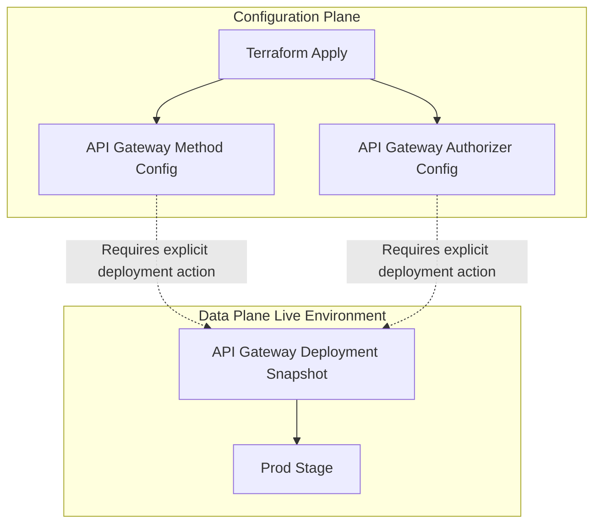

## Section 4: Architectural Debugging and Edge Case Validation

### Edge Case 1: The Token Type Mismatch and the `aud` Claim Boundary

**The Debugging Scenario**
During the operational testing phase, I encountered a critical authorization failure. After successfully authenticating via the AWS CLI and retrieving the Token Trio, I attempted to call the protected API Gateway endpoint using the Access Token in the `Authorization` header. The API immediately returned a `401 Unauthorized` error. However, when I swapped the header to use the ID Token, the request succeeded instantly. 

**The AWS Concept: The `aud` (Audience) Claim**
To understand this failure, it is necessary to examine the mechanics of the `aud` claim, which is a standard, registered claim defined in the JSON Web Token (JWT) specification (RFC 7519). The `aud` claim identifies the specific recipients or services for which the token is intended. It acts as a critical security boundary to prevent "Token Confusion" or "Replay Attacks." If a user authenticates with Service A, the token contains an audience claim for Service A. If the user attempts to use that exact same token to access Service B, Service B will check the audience claim, see it is intended for Service A, and reject it.

**The Root Cause Analysis**
The failure was not caused by an invalid signature or an expired token; the Access Token was cryptographically valid. The failure was caused by a structural mismatch between the token's claims and the default validation logic of the API Gateway Cognito Authorizer.

Because I did not configure explicit OAuth scopes on the API Gateway Authorizer, it defaulted to standard identity validation. In this unscoped state, the authorizer strictly requires the presence of the audience claim within the JWT, verifying that it matches the configured App Client ID.

The structural difference between the two tokens dictates this behavior:

**The ID Token (Success)**
```json
{
  "sub": "a1b2c3d4-e5f6-7890-g1h2-i3j4k5l6m7n8",
  "email": "student1@lizzo.com",
  "aud": "5s8e3t2v1w0x9y8z7a6b5c4d3e",
  "token_use": "id"
}
```
The ID Token inherently contains the audience claim. Therefore, it perfectly satisfies the default validation requirements of the unscoped authorizer.

**The Access Token (Failure)**
```json
{
  "sub": "a1b2c3d4-e5f6-7890-g1h2-i3j4k5l6m7n8",
  "scope": "aws.cognito.signin.user.admin",
  "client_id": "5s8e3t2v1w0x9y8z7a6b5c4d3e",
  "token_use": "access"
}
```
The Access Token does not contain an audience claim. Instead, it utilizes a client identifier claim and a scope claim. Because the unscoped REST API authorizer explicitly checks for the audience claim, the Access Token fails this specific structural check, resulting in the unauthorized response.

**The Resolution and Architectural Pivot**
To resolve the immediate error, I updated my CLI testing script to extract and pass the ID Token instead of the Access Token. 

From an architectural standpoint, if I needed to utilize the Access Token for fine-grained, scope-based authorization in the future, I would have to explicitly reconfigure the system to shift the authorizer's focus away from the audience claim. This requires creating a Resource Server within the Amazon Cognito User Pool, defining custom scopes, assigning those scopes to the App Client, and populating the authorization scopes field in the API Gateway Authorizer. Once scopes are defined, the validation logic shifts from checking the audience claim to checking the scope claim.

### Edge Case 2: The "Missing Redeploy" Security Gap

**The Debugging Scenario**
After writing the Terraform configuration to create the Cognito Authorizer and attach it to the API Gateway methods, I executed the apply command. The apply completed successfully, but when I tested the API endpoint without a token, it still returned a `200 OK` response. The security boundary I had just built was completely ignored.

**The AWS Concept: Configuration Plane vs. Data Plane**
This behavior is a fundamental characteristic of REST APIs in AWS. API Gateway strictly separates the configuration plane (the underlying routing rules and authorizers you build) from the data plane (the live, executable environment that handles incoming traffic). 

Modifying an API Gateway Method or Authorizer only updates the configuration plane. The live production stage continues to serve the exact snapshot of the configuration that was last explicitly deployed. If you do not push the new configuration to the data plane, your security controls exist in Terraform state, but they are entirely inactive in the live environment.

The following diagram illustrates this separation:



**The Root Cause Analysis**
Because I only updated the Method and Authorizer resources, the configuration plane was updated, but the deployment resource was not triggered to recreate. The live production stage was still pointing to the old deployment snapshot, which had authorization set to none.

**The Resolution and Terraform Implementation**
To resolve this and prevent it from happening in future deployments, I implemented an automated dependency chain using the triggers block within the deployment resource. 

By taking the unique identifiers of the routing components (the Resources, Methods, Integrations, and the Authorizer), encoding them into a JSON string, and generating a SHA1 hash, Terraform can detect infrastructure changes. During a plan execution, if any of those underlying resources are created, destroyed, or modified, their identifiers change. This changes the SHA1 hash. Terraform detects the change in the triggers block and automatically forces the destruction and recreation of the Deployment resource, pushing the new configuration to the live Stage.

```hcl
resource "aws_api_gateway_deployment" "main" {
  rest_api_id = aws_api_gateway_rest_api.main.id

  triggers = {
    redeployment = sha1(jsonencode([
      aws_api_gateway_resource.python_route.id,
      aws_api_gateway_method.python_get.id,
      aws_api_gateway_integration.python_lambda.id,
      aws_api_gateway_authorizer.cognito.id
    ]))
  }

  lifecycle {
    create_before_destroy = true
  }
}
```

By implementing this trigger, I ensured that any modification to the authentication configuration automatically forces a stage redeployment, guaranteeing that the security boundary is always active in the data plane immediately following an infrastructure update.

### Edge Case 3: The "Oldish Look" and the V1/V2 Rendering Divergence

**The Debugging Scenario**
After successfully provisioning the Cognito Domain and applying the Terraform configuration, I accessed the Hosted UI URL only to find a basic, "oldish" login page with a simple white box on a grey background. This was the Legacy Version 1 interface, not the modern Version 2 interface I had observed in the AWS Console. The page lacked the full-screen layout, modern typography, and responsive design of the V2 interface.

**The AWS Concept: Dual Architecture and Silent Fallback**
Amazon Cognito maintains two distinct login page architectures that coexist within the same service. The **Legacy Hosted UI (Version 1)** is the older, basic interface controlled via the `aws_cognito_user_pool_ui_customization` resource using custom CSS. The **Managed Login Branding (Version 2)** is the modern, full-screen interface with enhanced security features and responsive design, controlled via the `aws_cognito_managed_login_branding` resource.

Critically, Cognito does not throw an error when the V2 branding model is missing or misconfigured. Instead, it silently falls back to the Legacy V1 interface. This behavior creates a "configuration gap" where the infrastructure appears to be successfully deployed (no Terraform errors, domain is active), but the user experience is degraded because the V2 rendering engine was never activated.

This also highlights a significant divergence between the AWS Console and Infrastructure as Code. When creating a login page through the Console, AWS automatically provisions the V2 branding model in the background, masking the complexity from the user. In Terraform, this automation does not exist; the engineer must explicitly define the branding resource.

**The Root Cause Analysis**
The fallback to V1 was caused by a combination of configuration gaps:
1.  **Missing Branding Resource:** The `aws_cognito_managed_login_branding` resource was not present in the Terraform state, leaving Cognito with no instruction to use V2.
2.  **Missing OAuth Flags:** The App Client lacked the `allowed_oauth_flows_user_pool_client = true` flag. Even with the branding resource present, Cognito ignores V2 branding if the App Client is not OAuth-enabled.
3.  **V1/V2 Conflict:** The legacy `aws_cognito_user_pool_ui_customization` resource was initially present in the configuration. This resource forces the V1 rendering engine, overriding any V2 branding attempts. The V1 and V2 rendering engines are mutually exclusive.

**The Resolution and Terraform Implementation**
To resolve this, I implemented a three-step verification process to explicitly activate the V2 interface:

1.  **Add the V2 Branding Resource:** I added the `aws_cognito_managed_login_branding` resource with `use_cognito_provided_values = true` and explicitly linked it to the App Client via the `client_id` argument. This instructs AWS to apply its default V2 visual theme without requiring a complex custom JSON branding model.

```hcl
resource "aws_cognito_managed_login_branding" "v2_default" {
  user_pool_id                = aws_cognito_user_pool.main.id
  client_id                   = aws_cognito_user_pool_client.client.id
  use_cognito_provided_values = true
}
```

2.  **Verify OAuth Configuration:** I verified that the `aws_cognito_user_pool_client` resource contained the required OAuth flags. Without these, the V2 branding is ignored.

```hcl
resource "aws_cognito_user_pool_client" "client" {
  # ... other arguments ...
  
  allowed_oauth_flows                  = ["code"]
  allowed_oauth_scopes                 = ["openid", "email", "profile"]
  allowed_oauth_flows_user_pool_client = true
  supported_identity_providers         = ["COGNITO"]
}
```

3.  **Remove V1 Customization:** I searched the entire Terraform codebase for `aws_cognito_user_pool_ui_customization` and removed it entirely to prevent rendering conflicts.

After running `terraform apply` and clearing the browser cache (which aggressively caches login pages), the Hosted UI immediately rendered the modern V2 interface, matching the experience observed in the AWS Console.

**The Operational Lesson**
This edge case highlights a critical lesson for Infrastructure as Code practitioners: "it worked in the console" does not guarantee "it will work in Terraform" without explicitly defining the underlying resources that the Console created automatically. Engineers must be aware of the silent fallback behaviors in AWS services and proactively verify that the deployed user experience matches the intended architecture, not just the absence of Terraform errors.

***

**Sources for Section 4:**
*   [IETF RFC 7519: JSON Web Token (JWT) - Section 4.1.3: Audience Claim](https://datatracker.ietf.org/doc/html/rfc7519#section-4.1.3)
*   [AWS Documentation: Using Tokens with Amazon Cognito (ID vs. Access Token Claims)](https://docs.aws.amazon.com/cognito/latest/developerguide/amazon-cognito-user-pools-using-tokens-with-identity-providers.html)
*   [AWS Documentation: Controlling Access to a REST API with an Amazon Cognito User Pool Authorizer](https://docs.aws.amazon.com/apigateway/latest/developerguide/apigateway-integrate-with-cognito.html)
*   [AWS Documentation: API Gateway REST API Deployment and Stages (Configuration vs. Data Plane)](https://docs.aws.amazon.com/apigateway/latest/developerguide/how-to-deploy-stages.html)
*   [Terraform Registry: aws_api_gateway_deployment (Triggers and Redeployment Mechanics)](https://registry.terraform.io/providers/hashicorp/aws/latest/docs/resources/api_gateway_deployment)
*   [Terraform Registry: aws_cognito_managed_login_branding](https://registry.terraform.io/providers/hashicorp/aws/latest/docs/resources/cognito_managed_login_branding)
*   [AWS Documentation: Managed Login Branding for Amazon Cognito User Pools](https://docs.aws.amazon.com/cognito/latest/developerguide/managed-login-branding.html)
*   [AWS Documentation: Customizing the Hosted UI](https://docs.aws.amazon.com/cognito/latest/developerguide/cognito-user-pools-custom-ui.html)

