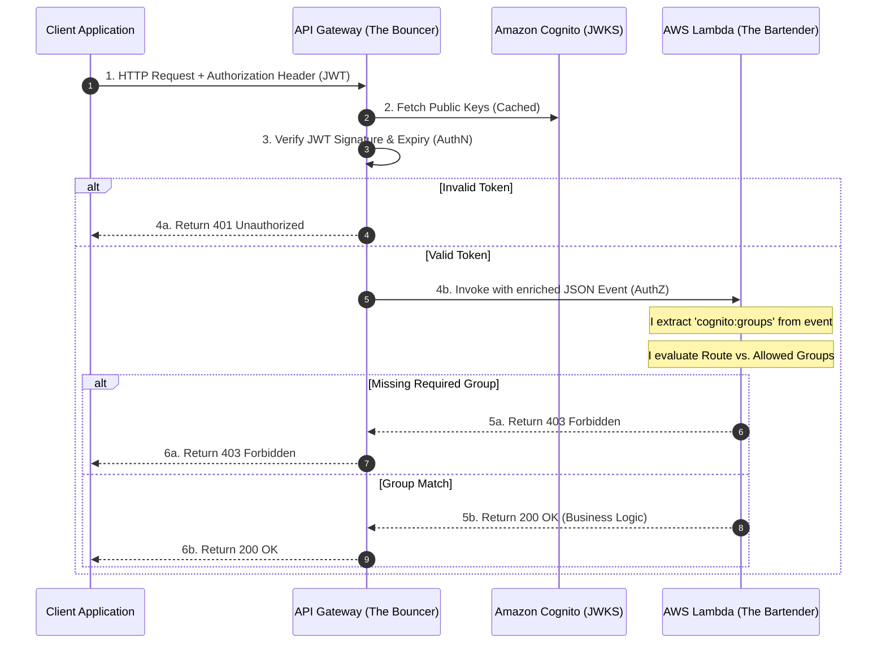

# RBAC Implementation Module
## Document 1: Architectural Foundations - My Shift from Authentication to Authorization

### 1.1 The Core Distinction: Identity vs. Permissions
In the previous phases of my project, I successfully implemented Amazon Cognito to handle **Authentication (AuthN)**. By integrating Cognito with API Gateway, I established a strict identity perimeter. My system can now definitively answer the question: *"Who are you?"* Every request reaching my compute layer is backed by a cryptographically signed JSON Web Token (JWT) representing a verified user.

However, I realized that Authentication alone is insufficient for a secure, multi-tenant application. Just because a user has a valid ID does not mean they should have access to every resource. This introduced **Authorization (AuthZ)**, which answers the question: *"What are you allowed to do?"* 

To implement Authorization, I introduced **Role-Based Access Control (RBAC)**. In my design, permissions are not assigned to individual users; instead, permissions are assigned to Roles (Cognito Groups), and users are assigned to those Roles. 

### 1.2 My Enterprise Mental Model
To contextualize my architecture within broader enterprise IT, I found it highly effective to map my Amazon Cognito concepts to Microsoft Active Directory (AD) and Microsoft Entra ID. 

The mental model I used is identical, just hosted in the AWS cloud:
*   **My Cognito User Pool User** = Active Directory User
*   **My Cognito Group** = Active Directory Security Group
*   **My Group Membership** = Role Assignment

When an enterprise user logs into a corporate application, their identity token contains a list of the AD Security Groups they belong to. The application reads these claims to determine what data the user can access. In my project, Amazon Cognito performs the exact same function, injecting a `cognito:groups` array into the JWT for my backend to evaluate.

### 1.3 The "Bouncer and Bartender" Paradigm
To conceptualize how I divided Authentication and Authorization across my AWS infrastructure, I utilized the "Bouncer and Bartender" paradigm. This clearly defines the boundary of responsibilities between my API Gateway and my Lambda functions.

**The Bouncer (API Gateway & Cognito Authorizer)**
I configured API Gateway to act as the bouncer at the door of the club. When an HTTP request arrives, the API Gateway Cognito Authorizer intercepts it. It checks the JWT, verifies the cryptographic signature against Cognito's public keys (JWKS), and ensures the token is not expired. 
*   *If the ID is fake or expired, the Bouncer rejects the request immediately (401 Unauthorized). The request never enters the club.*
*   *If the ID is valid, the Bouncer lets the request in and hands them a wristband (the enriched `event` payload containing the `cognito:groups` claims).*

**The Bartender (AWS Lambda)**
I designed my Lambda functions to act as the bartenders inside the VIP room. The Bartender does not care about checking the cryptographic signature of the ID—that is the Bouncer's job. The Bartender only looks at the wristband. 
*   *If a user asks for top-shelf liquor (e.g., the `/node` admin route), but their wristband only says "student", the Bartender refuses to serve them (403 Forbidden).*
*   *If the wristband matches the required role, the Bartender executes the business logic.*

The following sequence diagram illustrates my exact division of labor:

By offloading the heavy cryptographic lifting (AuthN) to API Gateway, I freed my Lambda functions to focus entirely on business logic and fine-grained access control (AuthZ). 

### 1.4 The Principle of Least Privilege
When designing the RBAC logic inside my Lambda functions, I strictly adhered to the **Principle of Least Privilege**. This security principle dictates that a user should only be granted the exact permissions they need to perform their job, and nothing more.

In my application logic, this meant avoiding "Implicit Allow" (Negative Authorization) and instead enforcing "Explicit Allow" (Positive Authorization). 

*   **Implicit Allow (Insecure):** "If the user is not an Admin, block them from `/node`. Otherwise, let them in." 
    *   *The flaw I identified:* An unassigned user with no roles would accidentally be granted access to `/python` because they aren't blocked by the `/node` check. The system defaults to "allow".
*   **Explicit Allow (Secure):** "Check the route. Check the user's groups. If the user's groups do not explicitly match the allowed groups for this specific route, block them (403 Forbidden)."

By implementing Explicit Allow logic, I ensured my system defaults to a "deny-all" state. Access is only granted if the user's identity claims mathematically intersect with the route's required roles.

***

**Sources for Document 1:**
*   [AWS Documentation: Using Tokens with Amazon Cognito (cognito:groups claim)](https://docs.aws.amazon.com/cognito/latest/developerguide/amazon-cognito-user-pools-using-tokens-with-identity-providers.html)
*   [Microsoft Learn: Security Groups in Active Directory](https://learn.microsoft.com/en-us/windows-server/identity/ad-ds/manage/understand-security-groups)
*   [NIST Special Publication 800-162: Guide to Attribute Based Access Control (Context on RBAC and Least Privilege)](https://csrc.nist.gov/publications/detail/sp/800-162/final)
*   [AWS Documentation: Output from an Amazon Cognito User Pool Authorizer](https://docs.aws.amazon.com/apigateway/latest/developerguide/apigateway-cognito-authorizer-output.html)

