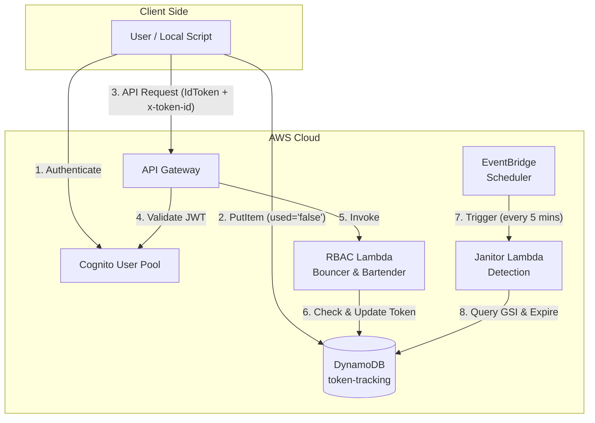

# Phases 1 & 2: The Stateful Foundation & Telemetry Producer

The foundation of this module is the `token-tracking` DynamoDB table and the local Python script designed to populate it. Unlike traditional relational databases (SQL) where the schema dictates the data, DynamoDB requires a "Question-First" design. The database schema is not built around the *data* I have; it is built strictly around the *questions* (Access Patterns) the application needs to ask.

Before diving into the specific database schema and IAM policies, it is helpful to visualize the high-level architecture of the entire system. The diagram below illustrates the three distinct pipelines (The Telemetry Producer, The API Request Pipeline, and The Automated Maintenance Pipeline) and how they interact with the central DynamoDB ledger.

As shown above, DynamoDB acts as the central source of truth. The local script writes to it, the API Lambda reads and updates it, and the EventBridge-driven Janitor cleans it up.

## Part 1: DynamoDB Design (The Stateful Foundation)

### Base Table Design: The Primary Lookup
The base table is designed to answer the most critical, high-frequency question in the system: *"Is this specific token valid?"*
* **Partition Key (HASH):** `token_id` (String)
* **Why:** When a user makes an API request, they provide a specific `x-token-id`. DynamoDB uses this HASH key to instantly route the request to the exact physical partition where that token lives, resulting in single-digit millisecond latency.

### Architectural Realization: Schema vs. Payload (The NoSQL Mindset)
A major architectural realization I had during this phase was understanding the strict boundary between **Keys** (Schema) and **Payload** (Data) in DynamoDB.

* **The Keys (The Envelope Address):** In Terraform, the `attribute {}` blocks are used *strictly* to define the attributes that will act as Partition or Sort keys. These are the "addresses" DynamoDB uses to organize and index the data.
* **The Payload (The Letter Inside):** DynamoDB is entirely schemaless for its payload. Attributes like `username` do not need to be defined in the Terraform schema. The Python script can write them dynamically, and DynamoDB will blindly store them. 

**Application in this Lab:** 
I intentionally **excluded** `username` from the Terraform `attribute {}` schema. Because the business requirement does not demand querying the database *by* username, indexing it would be a waste of compute and storage. Instead, `username` is written purely as payload data. The Janitor Lambda simply reads it from the payload to generate helpful CloudWatch logs, proving that I can store and retrieve data without paying the tax of indexing it. *(Note: This also helped me navigate Terraform's strict "Unused Attributes" rule, which throws an error if an attribute is defined at the top level but not actively used as a Key).*

### Architectural Realization: Access Pattern Modeling & The GSI
While the base table handles single-token lookups perfectly, the automated Janitor Lambda (introduced in Phase 4) requires a completely different question: *"Find ALL tokens across ALL users that are currently unused, and identify which ones are older than 10 minutes."*

Attempting to answer this question using the base table would require a `Scan` (reading every single item in the database), which is an expensive, slow anti-pattern in DynamoDB. To solve this, I utilized **Access Pattern Modeling** to build a dedicated Global Secondary Index (GSI).

**The GSI Design:**
* **Partition Key (HASH):** `used` (String)
* **Sort Key (RANGE):** `issued_at` (String - ISO8601 format)

**Why this specific design?**
1. **The HASH Key (`used`):** By making the status the Partition Key, DynamoDB groups all `"false"` (unused) tokens together on a single, virtual "shelf." This allows the Janitor to instantly jump to the unused tokens without looking at the `"true"` or `"expired"` ones.
2. **The RANGE Key (`issued_at`):** Once DynamoDB is on the `"false"` shelf, the Sort Key allows it to instantly filter chronologically. Because ISO8601 timestamps sort perfectly in alphabetical order, the Janitor can execute a lightning-fast `Query` using the condition `issued_at < [10 minutes ago]`.

---

## Part 2: The Telemetry Producer (Local Script & IAM)

Before an API request can be validated, a token must first be generated and registered in the stateful ledger. This phase introduced the Telemetry Producer: a local Python script (`easier_get_token_v3.py`) designed to simulate a client authenticating, generating a unique session token, and logging it to DynamoDB.

### The Producer Workflow
I architected the script to separate the authentication process from the telemetry logging, ensuring a clean, user-friendly execution flow:
1. **Authentication (AuthN):** The script prompts the user for their Cognito credentials, handles the SRP protocol and any MFA challenges.
2. **Token Extraction:** Upon success, it extracts the `IdToken` (used for API Gateway authorization) and the `AccessToken`.
3. **Dynamic Telemetry Configuration:** Before writing to the database, the script prompts the user for the specific DynamoDB Table Name and Region, keeping the script entirely environment-agnostic.
4. **UUID Generation & Ledger Write:** The script generates a cryptographically secure UUID (the `token_id`), captures the current timestamp in ISO8601 format, and executes a `put_item` command to write the initial state (`used = "false"`) to DynamoDB.

### The Boolean Trap Fix
During the initial development of the producer script, a critical NoSQL "gotcha" was encountered. The original script wrote the `used` attribute as a native Python Boolean (`False`). 

However, as discovered in Phase 1, DynamoDB Global Secondary Indexes (GSIs) cannot use native Booleans as key attributes. To ensure the `used` attribute could be utilized as the Partition Key for the GSI, I refactored the script to explicitly cast the state to a String (`"false"`). This seemingly minor data-type enforcement was crucial for the downstream architecture to function.

### IAM Strategy: Dynamic ARN Injection & Least Privilege
To allow the local script to write to DynamoDB, an IAM User/Role was required. However, hardcoding the DynamoDB Table ARN into a static IAM JSON policy violates Infrastructure as Code (IaC) best practices, as the ARN is generated dynamically by Terraform.

**The Solution: Terraform `templatefile`**
I utilized Terraform's `templatefile()` function to bridge the gap between static policy files and dynamic infrastructure:
1. **The Template:** A standard IAM JSON policy file was created, containing a placeholder variable (e.g., `${dynamodb_table_arn}`).
2. **The Injection:** In the Terraform code, the `templatefile` function reads this JSON file and dynamically replaces the placeholder with the actual ARN of the `aws_dynamodb_table` resource created in Phase 1.
3. **The Result:** The IAM role is granted strict `dynamodb:PutItem` permissions scoped *only* to the specific table ARN. This perfectly enforces the **Principle of Least Privilege**, ensuring the producer script can only write to its designated ledger and nothing else in the AWS account.

---

## Sources & Useful References (Phases 1 & 2)

*   **DynamoDB Best Practices & Data Modeling:** 
    *   [AWS Documentation: Choosing the Right Partition Key](https://docs.aws.amazon.com/amazondynamodb/latest/developerguide/HowItWorks.CoreComponents.html#HowItWorks.CoreComponents.PrimaryKey) - Crucial for understanding the "Question-First" access pattern methodology and how HASH/RANGE keys physically distribute data.
*   **DynamoDB Schemaless Nature (Payload vs. Keys):**
    *   [AWS Documentation: Working with Items in DynamoDB](https://docs.aws.amazon.com/amazondynamodb/latest/developerguide/WorkingWithItems.html) - Highlights that DynamoDB only requires keys to be defined at the table level; all other attributes are schemaless payload data.
*   **Global Secondary Index (GSI) Key Requirements:**
    *   [AWS Documentation: GSI Key Schema](https://docs.aws.amazon.com/amazondynamodb/latest/developerguide/GSI.html) - Specifically documents the rule that GSI Partition and Sort keys *must* be of type String, Number, or Binary (which drove the "Boolean Trap" fix).
*   **Terraform `templatefile` Function:**
    *   [Terraform Language Documentation: templatefile](https://developer.hashicorp.com/terraform/language/functions/templatefile) - The official guide on using this function to read external files and inject dynamic variables (used for the IAM JSON policy).
*   **IAM Policies for DynamoDB:**
    *   [AWS Documentation: How IAM Rules Apply to DynamoDB](https://docs.aws.amazon.com/amazondynamodb/latest/developerguide/specifying-conditions.html) - Essential for understanding how to scope `dynamodb:PutItem` permissions strictly to a specific table ARN using the Principle of Least Privilege.