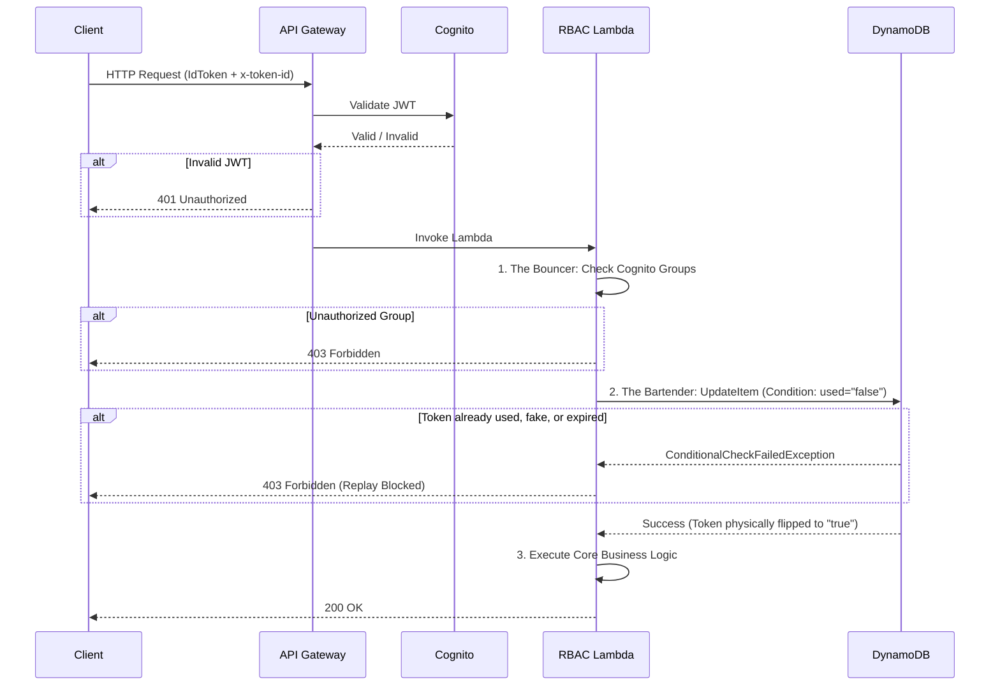

# Phase 3: The Bouncer & The Bartender (RBAC & Replay Prevention)

With the database foundation laid and the telemetry producer generating tokens, Phase 3 focused on the core API Lambda functions. The objective was to transform siloed, proof-of-concept scripts into a unified, enterprise-grade security pipeline that handles both authorization and stateful validation.

## The Refactoring Journey: From Silos to a Unified Pipeline
Initially, I had the system's logic fragmented across three separate code files: one for basic API responses (Business Logic), one for Cognito group validation (RBAC), and a mentor-provided snippet for DynamoDB updates. 

To create a robust "Defense-in-Depth" workflow, I refactored these into a single, cohesive Lambda function that executes in a strict, linear sequence:
1. **The Bouncer (Authorization):** The RBAC logic runs first. It extracts the `cognito:groups` claim from the validated JWT and checks it against an allowed list (e.g., `["admin", "student"]`) stored in Environment Variables. If the user lacks the required role, the Lambda instantly returns a `403 Forbidden`.
2. **The Bartender (Telemetry):** The token tracking logic runs second. It extracts the custom `x-token-id` from the request headers and attempts to update the DynamoDB ledger. 
3. **The Execution (Business Logic):** Only if both the Bouncer and the Bartender pass their checks does the core API logic execute, returning a `200 OK` to the client.


To fully grasps the "Defense-in-Depth" nature of the refactored Lambda, a sequence diagram is the most effective way to visualize the strict, linear execution flow. The diagram below maps the journey of a single API request, highlighting exactly where the "Bouncer" (RBAC) and the "Bartender" (Telemetry) intercept and validate the traffic.



This sequence proves that the business logic (Step 3) is completely shielded. It cannot execute unless the user passes the Bouncer (Step 1) and the Bartender successfully secures the token in DynamoDB (Step 2).

## The Magic of the Conditional Write (Replay Prevention)
The most critical security mechanism in this phase is the prevention of **replay attacks**. If an attacker intercepts a valid API request (containing a valid JWT and a valid `x-token-id`), they might try to send that exact same request 50 times to execute the action 50 times.

To prevent this, the "Bartender" logic utilizes a DynamoDB **Conditional Write**:
```python
# Python (boto3) implementation
table.update_item(
    Key={"token_id": token_id},
    UpdateExpression="SET used = :u",
    ConditionExpression="used = :old_u", # The Magic Line
    ExpressionAttributeValues={
        ":u": "true",
        ":old_u": "false"
    }
)
```

**How it works:** 
The `ConditionExpression="used = :old_u"` tells DynamoDB: *"Update this token to 'true', BUT ONLY IF its current state is exactly 'false'."* 

Because DynamoDB operations are atomic and physically locked at the storage partition level, if 50 identical requests hit the database at the exact same millisecond, DynamoDB will process the very first one, flip the token to `"true"`, and instantly reject the other 49 with a `ConditionalCheckFailedException`. The Lambda catches this specific exception and returns a `403 Forbidden`, effectively neutralizing the replay attack before any business logic can run.

## Performance Optimization: Lambda Connection Reuse
During the refactoring process, I applied a major performance optimization to the Lambda functions. 

In AWS Lambda, the execution environment is "frozen" after a request and "thawed" for the next one. By moving the AWS SDK client initialization (`boto3.resource`) **outside** the main `lambda_handler` function, the Lambda only has to establish the network connection to DynamoDB on the very first ("cold") invocation. All subsequent ("warm") invocations reuse that existing TCP connection, saving hundreds of milliseconds of latency per request and drastically improving the API's responsiveness.

## Separation of Code and Configuration
Finally, the refactored code eliminated all hardcoded values. Table names, AWS regions, and expected API routes are now pulled dynamically using Environment Variables (e.g., `os.environ.get("DYNAMODB_TABLE_NAME")`). This ensures that the exact same Lambda code can be deployed to Dev, Test, and Prod environments seamlessly, with Terraform simply injecting the correct variables at deployment time.

---

## Sources & Useful References (Phase 3)

*   **DynamoDB Conditional Writes & Optimistic Locking:**
    *   [AWS Documentation: Condition Expressions](https://docs.aws.amazon.com/amazondynamodb/latest/developerguide/Expressions.ConditionExpressions.html) - The official guide on how to use `ConditionExpression` to enforce business rules and prevent race conditions at the database level.
*   **Lambda Execution Context & Connection Reuse:**
    *   [AWS Documentation: Lambda Execution Environment](https://docs.aws.amazon.com/lambda/latest/dg/lambda-runtime-environment.html) - Explains the "freeze/thaw" lifecycle of Lambda containers.
    *   [AWS Documentation: Best Practices for Working with AWS SDKs](https://docs.aws.amazon.com/lambda/latest/dg/best-practices.html#best-practices-sdk) - Explicitly recommends initializing SDK clients outside the handler to leverage connection reuse and reduce latency.
*   **Cognito User Pool Claims & RBAC:**
    *   [AWS Documentation: Cognito User Pool Claims](https://docs.aws.amazon.com/cognito/latest/developerguide/amazon-cognito-user-pools-using-the-id-token.html) - Details how custom attributes and groups are mapped into the JWT payload for Lambda extraction.
*   **Lambda Environment Variables:**
    *   [AWS Documentation: AWS Lambda Environment Variables](https://docs.aws.amazon.com/lambda/latest/dg/configuration-envvars.html) - The guide on configuring runtime environment variables to separate code from configuration.

***
