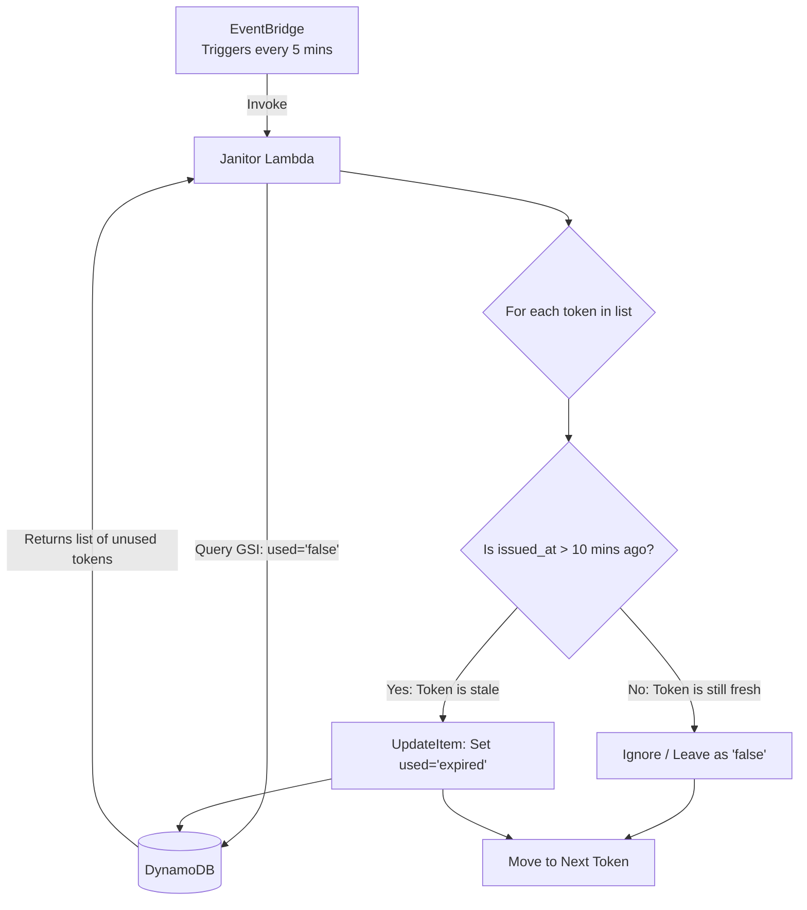

# Phase 4: The Janitor (Automated Expiration)

While Phase 3 successfully secured the API against replay attacks, it introduced a secondary architectural challenge: the "leaky bucket" scenario. If a user runs the telemetry producer script to generate a token but then closes their terminal without ever making the API request, that token sits in the DynamoDB table forever with a status of `"false"`. 

To prevent database bloat and maintain a zero-trust security posture, I built an automated, serverless maintenance pipeline to continuously identify and expire orphaned tokens.

## The Clock: Amazon EventBridge Scheduler
To trigger the cleanup process without relying on external cron jobs or always-on servers, I utilized Amazon EventBridge. 
* **The Rule:** An EventBridge Rule was configured with a `schedule_expression` of `rate(5 minutes)`. 
* **The Target & Handshake:** The rule targets the Detection Lambda. Crucially, I had to add a specific `aws_lambda_permission` resource to the Lambda's resource-based policy. This explicitly allows the `events.amazonaws.com` service principal to invoke the function. Without this specific security handshake, EventBridge would fire, but AWS would block the invocation with an `AccessDenied` error.

## The Query: Bypassing the Base Table Limitations
When the Detection Lambda wakes up, it needs to find all tokens that are unused and older than a specific threshold (e.g., 10 minutes). 

Attempting to do this on the base table (where the Partition Key is `token_id`) would require a full-table `Scan`, which is highly inefficient and expensive as the database grows. Instead, the Lambda leverages the dedicated Global Secondary Index (GSI) built specifically for this access pattern (HASH: `used`, RANGE: `issued_at`). 

By querying this GSI, the Lambda executes a lightning-fast, highly efficient `Query`. It tells DynamoDB: *"Go directly to the partition where `used` equals `"false"`, and hand me every item where the `issued_at` timestamp is older than my calculated threshold."* 

While the sequence diagram in Phase 3 perfectly illustrated the synchronous API request, the Janitor pipeline is asynchronous and logic-driven. The flowchart below visualizes the automated decision-making process of the Detection Lambda once it is woken up by EventBridge.

This flowchart highlights the efficiency of the GSI. Because we query the used = 'false' partition directly, the Lambda only iterates through the orphaned tokens, completely ignoring the millions of "true" or "expired" tokens sitting in the database.

## Architectural Decision: Expiration vs. Deletion
When the Lambda identifies a stale token, it must take action. The initial concept was to simply `DeleteItem` from the database. However, I refactored this to an `UpdateItem` operation that changes the `used` attribute from `"false"` to `"expired"`.

**Why mark as "expired" instead of deleting?**
In enterprise environments, **auditability is paramount**. If a user contacts support claiming, "I generated a valid token, but the API rejected it," a deleted token leaves no trace, making troubleshooting impossible. By changing the status to `"expired"`, the database retains a permanent, immutable audit trail. Security teams can easily verify that the token existed but was automatically expired due to inactivity. Furthermore, because the Phase 3 RBAC Lambda strictly checks for `used = "false"`, an `"expired"` token is automatically and gracefully rejected by the API.

## Separation of Code and Configuration
To ensure the maintenance pipeline is flexible across different environments (Dev, Test, Prod), the expiration threshold is not hardcoded in the Python logic. Instead, the Lambda reads an `EXPIRATION_MINUTES` environment variable (defaulting to 10). This allows infrastructure administrators to adjust the token lifespan dynamically via Terraform or the AWS Console without needing to redeploy or recompile the Lambda code.

---

## Sources & Useful References (Phase 4)

*   **Amazon EventBridge Rules & Scheduling:**
    *   [AWS Documentation: Creating Amazon EventBridge Rules](https://docs.aws.amazon.com/eventbridge/latest/userguide/eb-create-rule.html) - The official guide on setting up `rate()` and `cron()` schedule expressions for automated triggers.
*   **Lambda Resource-Based Policies (Cross-Service Invocation):**
    *   [AWS Documentation: Resource-Based Policies](https://docs.aws.amazon.com/lambda/latest/dg/access-control-resource-based.html) - Crucial for understanding the difference between an IAM Role (what the Lambda can do) and a Resource Policy (who/what is allowed to invoke the Lambda).
*   **DynamoDB Query vs. Scan Operations:**
    *   [AWS Documentation: Query and Scan](https://docs.aws.amazon.com/amazondynamodb/latest/developerguide/Query.html) - Explains the massive performance and cost differences between reading a specific partition (`Query`) versus reading the entire table (`Scan`).
*   **Terraform EventBridge & Lambda Permissions:**
    *   [Terraform Registry: aws_cloudwatch_event_rule](https://registry.terraform.io/providers/hashicorp/aws/latest/docs/resources/cloudwatch_event_rule) & [aws_lambda_permission](https://registry.terraform.io/providers/hashicorp/aws/latest/docs/resources/lambda_permission) - The specific Terraform resources required to wire the EventBridge clock to the Lambda target securely.