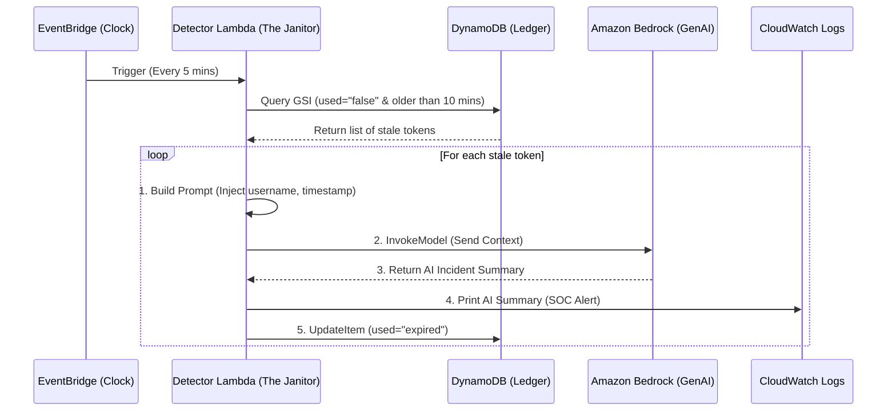

# Phase 5: AI-Enriched SOAR (The Philosophy & Architecture)

With the stateful foundation, telemetry producer, API security, and automated janitor pipeline complete, Phase 5 represents a massive conceptual leap. I am transitioning this project from a passive state-tracking system into an active **Security Orchestration, Automation, and Response (SOAR)** pipeline. 

By integrating Amazon Bedrock (Generative AI) into the existing Detection Lambda, the system no longer just cleans up abandoned tokens; it now acts as a cognitive security engine, enriching raw telemetry with actionable intelligence.

## The Core Philosophy: SIEM vs. SOAR
Before writing any AI code, I had to clearly define the boundary between detection and response. In the security industry, these are often confused, but they serve entirely different purposes:

| System | Purpose | Analogy |
| :--- | :--- | :--- |
| **SIEM** (Security Information & Event Management) | Collect, aggregate, and analyze logs. | The **Security Camera**. It watches, records, and beeps when it sees motion. It is *passive*. |
| **SOAR** (Security Orchestration, Automation, & Response) | Automate investigation and execute response workflows. | The **Security Guard**. When the camera beeps, the guard investigates, locks the door, and calls the police. It is *active*. |

In Phases 1 through 4, I built a lightweight SOAR pipeline: EventBridge detected an anomaly (an unused token), and Lambda responded (marking it expired). However, the alert it generated (`[ALERT] Token abc-123 unused`) was "dumb." It told me *what* happened, but not *why* it mattered. Phase 5 introduces **AI Enrichment** to bridge that gap.

## The Golden Rule of AI in Security
When integrating Large Language Models (LLMs) into enterprise security workflows, I established a strict, non-negotiable architectural rule:

> **"AI provides interpretation. Humans provide judgment."**

AI is incredibly powerful at summarizing data, identifying patterns, and drafting reports. However, AI is also prone to hallucinations. If an AI misinterprets a log and automatically executes a destructive action (like deleting a user account or blocking a CEO's IP address), the business suffers an immediate outage. 

Therefore, in my architecture, **the AI is strictly kept in the "assistant" role**. 
1. The Python logic deterministically decides the action (e.g., "This token is stale, expire it").
2. Amazon Bedrock is only invoked to *write the report* (e.g., "Analyze this stale token event and provide a Severity rating and an Executive Summary for the SOC analyst").
3. The AI is explicitly forbidden via prompt engineering from recommending or executing autonomous containment actions.

## Architecture & Data Flow: The Enrichment Loop
The architecture for this phase does not require heavy new infrastructure. Instead, it augments the existing "Janitor" Lambda. When EventBridge wakes the Lambda, it now performs an enrichment loop before finalizing the database cleanup.

### The Workflow Breakdown:
1. **The Trigger:** EventBridge invokes the Lambda on a schedule.
2. **The Fetch:** The Lambda queries the DynamoDB GSI for orphaned tokens.
3. **The Enrichment:** For every stale token found, the Lambda formats a prompt containing the user's context and sends it to Amazon Bedrock.
4. **The Output:** Bedrock returns a structured analysis (Severity, Possible Causes, Analyst Recommendations).
5. **The Remediation:** The Lambda prints this rich summary to CloudWatch (and eventually SNS/Slack) and marks the token as `"expired"` in the database.

By decoupling the *decision* (Python) from the *interpretation* (Bedrock), the system remains highly resilient. If the AI service experiences an outage, the Python fallback ensures the security remediation (expiring the token) still succeeds.

---

## Sources & Useful References (Phase 5 - Philosophy)

*   **SOAR vs. SIEM Concepts:**
    *   [AWS Security Blog: Automating security operations](https://aws.amazon.com/blogs/security/category/security-identity-and-compliance/) - Excellent reading on how AWS native services map to traditional SOC automation and SOAR principles.
*   **Amazon Bedrock Architecture:**
    *   [AWS Documentation: What is Amazon Bedrock?](https://docs.aws.amazon.com/bedrock/latest/userguide/what-is-bedrock.html) - The foundational overview of how Bedrock acts as a serverless API gateway to various Foundation Models (FMs).
*   **Model Selection & Capabilities:**
    *   [AWS Documentation: Anthropic Claude Model Cards](https://docs.aws.amazon.com/bedrock/latest/userguide/model-card-anthropic-claude-opus-4-6.html) - Detailed breakdown of context windows, reasoning capabilities, and the crucial distinction between In-Region, Geo, and Global inference profiles.

