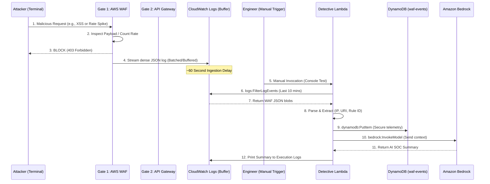

# WAF Telemetry & AI Analysis: Architecture & The "Two-Gate" Security Model

In this phase, the project transitions from internal state management (tracking JWT tokens) to active perimeter defense and threat intelligence gathering. By integrating AWS WAF (Web Application Firewall) with API Gateway, CloudWatch, and a serverless "Detective" Lambda, the architecture evolves into a true Cloud-Native Security Pipeline.

## 1. The "Two-Gate" Security Model (Defense in Depth)
When building public-facing APIs, understanding the exact sequence of security evaluations is critical for both architecture design and troubleshooting. Traffic hitting the API Gateway passes through two distinct security gates, operating at different layers of the network stack.

### Gate 1: AWS WAF (The Perimeter Shield)
AWS WAF is associated directly with the API Gateway Stage, sitting at the absolute edge of the infrastructure. It inspects the raw HTTP request *before* API Gateway evaluates method-level authorization or routes the request to backend integrations (like Lambda).
*   **What it evaluates:** IP addresses, request rates (DDoS/brute-force), and malicious payloads (SQL Injection, Cross-Site Scripting).
*   **The Response:** If WAF detects a violation (e.g., a Rate-Based rule limit is exceeded, or an XSS signature is found), it instantly drops the connection and forces API Gateway to return a **`403 Forbidden`**.
*   **The Golden Rule:** If Gate 1 blocks the request, Gate 2 never even sees it. The request is dead on arrival.

### Gate 2: API Gateway Authorization (The VIP Bouncer)
If WAF determines the request is "safe" (not a hack, not exceeding rate limits), it allows the request to proceed to API Gateway's internal method execution (Layer 7 Application).
*   **What it evaluates:** Identity and authorization (Cognito JWT tokens, IAM cryptographic signatures, or API Keys).
*   **The Response:** If the request lacks valid credentials, API Gateway rejects it with a **`401 Unauthorized`** (or `403`).

**The Edge Advantage (Why WAF Testing is Seamless):** 
Because WAF operates at the absolute edge, it processes and counts *all* incoming requests, regardless of what the backend application would ultimately do. Even if API Gateway is configured to reject unauthenticated terminal `curl` requests with a `401 Unauthorized`, WAF still counts those requests toward the Rate-Limit threshold. When the threshold is crossed, WAF intercepts the next request and returns a `403 Forbidden` before API Gateway's auth layer is even invoked. Similarly, malicious payloads are blocked by WAF before API Gateway ever checks for an auth token. 

This architectural reality means WAF rules can be rigorously tested and verified via standard terminal commands **without** needing to temporarily disable or alter API Gateway Authorization settings.

## 2. The Intermediary Buffer: Why CloudWatch?
A common architectural question is: *Why stream WAF logs to CloudWatch instead of directly to Lambda or Kinesis?*

In this architecture, CloudWatch Logs acts as a **durable, managed telemetry buffer**. 
1. **Decoupling:** WAF natively streams to CloudWatch without requiring complex Kinesis stream provisioning or shard management.
2. **The "WAF Buffer" Delay:** WAF logs are not strictly real-time; AWS batches and streams them to CloudWatch in intervals. Engineers must account for a ~60-second delay before logs are queryable. 
3. **Time-Window Querying:** Because the Lambda is currently triggered manually (rather than by a real-time event stream), it relies on the CloudWatch `FilterLogEvents` API to query a specific time window (e.g., "Give me all BLOCK events from the last 10 minutes"). This is highly cost-effective and prevents the Lambda from being overwhelmed by massive log volumes.

## 3. The Data Flow: From Attack to Intelligence (Current Iteration)
AWS WAF logs are notoriously dense, massive JSON blobs containing hundreds of HTTP headers. Humans do not read CloudWatch logs for fun. The goal of this architecture is to ingest these raw logs, extract the critical threat telemetry, and store it in a structured database for historical correlation and AI analysis.

*Architectural Note: In this current iteration (Lab A/B), the Detective Lambda is triggered manually via the AWS Console to prove the pipeline's viability and test IAM permissions. In future iterations, this will be automated via EventBridge scheduled rules.*

### The Workflow Breakdown:
1. **The Attack & Block:** The attacker triggers a WAF rule (or exceeds the rate limit). WAF forces a `403 Forbidden` response at the edge.
2. **The CloudWatch Buffer:** WAF streams the log to CloudWatch. 
3. **The Manual Trigger:** The engineer invokes the `waf-bedrock-analyzer` Lambda manually via the AWS Console to process the recent telemetry. 
4. **The Extraction:** The Python script uses `logs:FilterLogEvents` to query the time window, parses the dense JSON, and extracts only the security-critical context (`clientIp`, `uri`, `terminatingRuleId`) to save AI tokens and reduce noise.
5. **The Golden Rule (Persist First):** The Lambda writes the structured event to the `waf-events` DynamoDB table *before* attempting any AI enrichment. This ensures security telemetry is never lost if the AI service fails or is rate-limited.
6. **The Enrichment:** The extracted context is sent to Amazon Bedrock to generate a human-readable SOC (Security Operations Center) summary, which is printed to CloudWatch for the analysts.

## 4. Architectural Security & Least Privilege
The security of this pipeline is enforced via strict IAM boundaries. The Detective Lambda operates on a "need-to-know" basis, defined by three distinct IAM permissions:

*   **`logs:FilterLogEvents` (Scoped):** The Lambda is only permitted to read the specific WAF CloudWatch Log Group. It cannot read application logs or other sensitive infrastructure logs.
*   **`dynamodb:PutItem` (Scoped):** The Lambda can only write to the `waf-events` table. It cannot read, modify, or delete existing historical records, preventing accidental data corruption.
*   **`bedrock:InvokeModel` (Scoped):** The Lambda can only invoke the specific AI model designated for SOC summaries, preventing unauthorized use of expensive or unrelated AI models.

*Note: The baseline `AWSLambdaBasicExecutionRole` is used separately to handle the Lambda's own execution logging (`logs:CreateLogStream`, `logs:PutLogEvents`), maintaining a clean separation between infrastructure logging and business-logic permissions.*

---

## Sources & Useful References (Architecture)

*   **AWS WAF Web ACLs & Rate-Based Rules:**
    *   [AWS Documentation: Rate-based rule statement](https://docs.aws.amazon.com/waf/latest/developerguide/waf-rule-statement-type-rate-based.html) - Explains how WAF aggregates requests over custom evaluation windows (e.g., 300 seconds) to mitigate brute-force and DDoS attacks, independent of backend HTTP status codes.
*   **API Gateway Authorization & WAF Integration:**
    *   [AWS Documentation: Controlling access to API Gateway with API methods](https://docs.aws.amazon.com/apigateway/latest/developerguide/api-gateway-control-access-using-iam-policies-to-invoke-api.html) - Details the boundary between edge authorization (WAF) and method-level authorization (Cognito/IAM).
*   **WAF Logging to CloudWatch:**
    *   [AWS Documentation: Sending Amazon VPC logs to CloudWatch Logs](https://docs.aws.amazon.com/waf/latest/developerguide/logging-cloudwatch-logs.html) - Documents the strict naming requirement for WAF log groups (must begin with `aws-waf-logs-`) and the buffering mechanics of log streaming.
*   **IAM Least Privilege for Serverless:**
    *   [AWS Documentation: AWS Lambda Execution Role](https://docs.aws.amazon.com/lambda/latest/dg/lambda-intro-execution-role.html) - Best practices for separating basic execution logging from custom resource access policies.
