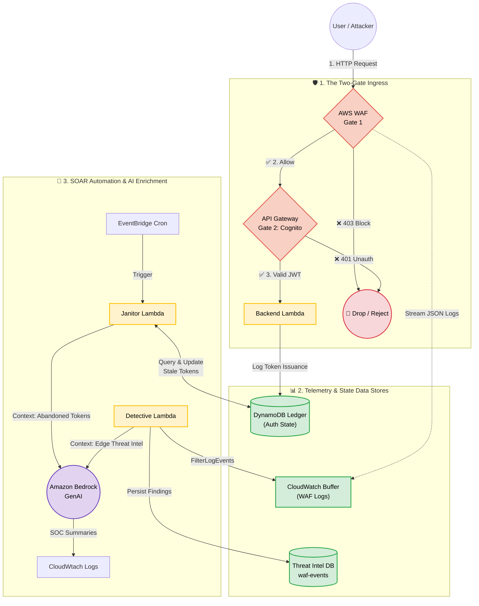

# 🛡️ Cloud-Native SOAR & AI-Driven Threat Intelligence Platform

## 📖 Project Overview
This repository documents the architecture, infrastructure, and codebase for a comprehensive **Security Orchestration, Automation, and Response (SOAR)** platform. 

What began as a stateful API authentication system has evolved into a multi-pipeline security engine. The platform actively manages **Identity and Access**, monitors **internal application state** (abandoned JWT tokens), and defends the **external perimeter** (WAF blocks, DDoS, XSS). It utilizes **Amazon Bedrock (Generative AI)** to translate raw, dense cloud telemetry into human-readable SOC (Security Operations Center) incident summaries.

---

## 🔐 Identity & Access: Cognito + API Gateway
The foundation of this entire platform rests on a secure, token-based authentication flow. Before any security telemetry can be generated or analyzed, users must securely prove their identity.

### 1. Amazon Cognito (The Identity Provider)
The platform uses an **Amazon Cognito User Pool** to manage user directories, handle secure sign-ups/sign-ins, and issue **JSON Web Tokens (JWTs)**. 
* When a user authenticates, Cognito returns an Access Token and an ID Token.
* These tokens contain cryptographically signed claims about the user's identity and permissions.

### 2. API Gateway Cognito Authorizer (Gate 2)
API Gateway sits in front of the backend Lambda functions and acts as the application-level bouncer. 
* It is configured with a **Cognito Authorizer**. 
* When a client makes a request, they must include the JWT in the `Authorization: Bearer <token>` header.
* API Gateway intercepts the request, fetches the public keys from the Cognito User Pool, and verifies the token's signature and expiration locally. 
* **The Result:** If the token is invalid or expired, API Gateway instantly rejects the request with a `401 Unauthorized` or `403 Forbidden` *before* the backend Lambda is ever invoked, saving compute costs and protecting the application logic.

### 3. The Stateful Ledger
Because JWTs are stateless by design, the backend Lambda maintains a **DynamoDB Ledger** to track token issuance and usage. This stateful tracking is the exact mechanism that allows the SOAR "Janitor" pipeline (detailed below) to detect abandoned or anomalous authentication sessions.

---

## 🏗️ Architecture: The Dual-Pipeline SOAR Model
With identity established, the platform operates on two distinct, automated security pipelines that feed into a centralized threat intelligence model.

### Pipeline 1: Internal State Remediation (The "Janitor")
Monitors the internal DynamoDB ledger for abandoned authentication tokens.
1. **EventBridge** triggers a "Janitor" Lambda on a schedule.
2. The Lambda queries DynamoDB for tokens that were issued by Cognito but never used to access protected APIs within the expiration window.
3. The telemetry is sent to **Amazon Bedrock** to generate a risk assessment of the abandoned session.
4. The token is deterministically marked as `expired` in the database, and the AI summary is logged for the security team.

### Pipeline 2: Edge Perimeter Defense (WAF Telemetry)
Monitors the absolute edge of the network for malicious payloads and brute-force attempts.
1. **AWS WAF (Gate 1)** inspects incoming API Gateway traffic. Malicious requests are dropped at the edge (`403 Forbidden`).
2. WAF streams dense JSON telemetry to a **CloudWatch Logs Buffer**.
3. A "Detective" Lambda queries the logs via time-window lookbacks (`FilterLogEvents`).
4. The Lambda extracts critical threat indicators (IP, URI, Rule ID) and persists them to a **Threat Intelligence DynamoDB Table** (`waf-events`).
5. The context is sent to **Amazon Bedrock** to generate an executive threat summary.



---

## 🧠 Core Engineering Triumphs & "Gotchas" Solved

Building this platform required navigating several complex cloud engineering challenges:

### 1. The Golden Rule of AI SOAR: Persist First
In security automation, AI is a luxury; data persistence is a necessity. Both Lambda pipelines are engineered to save or update the security telemetry in DynamoDB **before** invoking the Bedrock AI model. If the AI service experiences an outage, throttling, or billing error, the security workflow degrades gracefully, and zero evidence is lost.

### 2. The CloudWatch Log Group Race Condition
To prevent AWS Lambda from auto-creating CloudWatch Log Groups with "Never Expire" retention policies (which causes Terraform state drift), all Log Groups are explicitly provisioned in Terraform. The `depends_on` meta-argument is used to enforce strict creation order, ensuring IaC manages the lifecycle and compliance retention rules from Day 1.

### 3. Dynamic IAM & The `templatefile` Tuple Trap
Hardcoding AWS Account IDs in JSON IAM policies breaks environment portability. However, passing Terraform resources created with `for_each` loops into `templatefile()` results in a "tuple" interpolation error, injecting literal brackets `["..."]` into the IAM ARN. This was solved by stripping raw JSON templates of markdown comments, validating syntax, and utilizing exact bracket notation (e.g., `aws_cloudwatch_log_group.waf_logs["key"].arn`) to inject precise, least-privilege ARNs dynamically.

### 4. Graceful Degradation & The Billing Gatekeeper
Third-party AI models routed through the AWS Marketplace are subject to strict billing gatekeepers. Using `botocore.exceptions.ClientError`, the Python orchestration layer inspects specific AWS API error codes. If an `AccessDeniedException` related to marketplace billing occurs, the Lambda logs a clean `[WARN]` message and safely bypasses the AI step, ensuring the security pipeline remains unbroken.

### 5. Separation of Logic and Content
AI Prompts are strictly separated from Python orchestration logic. Prompts are stored in external `.txt` files and injected at runtime. This allows security analysts to tweak AI instructions (e.g., changing the desired SOC output format) without requiring a Python developer to modify and redeploy the Lambda codebase.

---

## 🛠️ Tech Stack
* **Identity & Access:** Amazon Cognito (User Pools, JWTs), API Gateway Authorizers
* **Cloud Security:** AWS WAFv2 (Managed Rules, Custom Rate-Limiting), Principle of Least Privilege IAM
* **Compute & Integration:** AWS Lambda, EventBridge, CloudWatch Logs
* **Data & AI:** DynamoDB, Amazon Bedrock (Anthropic Claude / Amazon Titan)
* **Infrastructure as Code:** Terraform (`templatefile`, `for_each`, `depends_on`, `archive_file`)
* **Language:** Python 3.x (`boto3`, `botocore`)

---

## 🧪 How to Test the Pipelines

### Test 1: The Identity Flow (Cognito + API Gateway)
1. Authenticate against the Cognito User Pool to retrieve a valid JWT Access Token.
2. Make a request to the protected API Gateway endpoint using the header: `Authorization: Bearer <your_jwt>`.
3. **Expected:** `200 OK`. The API Gateway Authorizer validates the signature and routes to Lambda.
4. Make the same request *without* the header or with a fake/expired token.
5. **Expected:** `401 Unauthorized` or `403 Forbidden` directly from API Gateway.

### Test 2: The Edge Perimeter (WAF Rate-Limit)
The WAF is configured with a custom evaluation window (`10 requests per 300 seconds`). 
1. Run this bash loop to simulate a credential-stuffing attack (WAF counts these requests *before* API Gateway evaluates the Cognito token):
   ```bash
   for i in {1..15}; do 
     echo "Request $i: $(curl -s -o /dev/null -w '%{http_code}' "https://<api-gateway-url>/prod/python?name=tee")"
   done
   ```
2. **Wait 60 seconds** for the WAF telemetry buffer to stream to CloudWatch.
3. Invoke the **Detective Lambda** manually via the AWS Console.
4. Verify the `waf-events` DynamoDB table for the newly persisted attacker IP and Rule ID.

### Test 3: The Edge Perimeter (XSS Payload)
1. Send a malicious payload (URL-encoded to prevent bash redirection errors):
   ```bash
   curl -s -o /dev/null -w '%{http_code}' "https://<api-gateway-url>/prod/python?name=%3Cscript%3Ealert(1)%3C/script%3E"
   ```
2. Expect an immediate `403 Forbidden` from the WAF edge shield.
3. Invoke the **Detective Lambda** and check CloudWatch for the AI-generated SOC summary detailing the Cross-Site Scripting attempt.

### Test 4: Internal State (The Janitor)
1. Authenticate via Cognito to generate a valid JWT token, which the backend logs in the DynamoDB Ledger.
2. Allow the token to sit unused past the expiration threshold.
3. Trigger the **Janitor Lambda** (or wait for the EventBridge cron).
4. Verify the token's state is updated to `expired` and check the logs for the AI's analysis of the abandoned session.

---

## 🔮 Future Roadmap
* [ ] **Automated EventBridge Routing:** Transition the WAF Detective Lambda from manual invocation to an automated EventBridge schedule.
* [ ] **SNS / Slack Integration:** Route the AI-generated SOC summaries to an SNS Topic for real-time push alerts to the security team.
* [ ] **SOAR Correlation Agent:** Build a secondary Lambda to query the `waf-events` table, identify repeat offenders (e.g., an IP hitting XSS and SQLi rules on different days), and automatically update network ACLs to block the IP at the VPC level.

